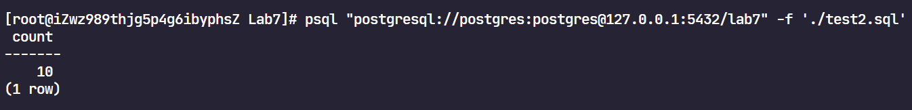
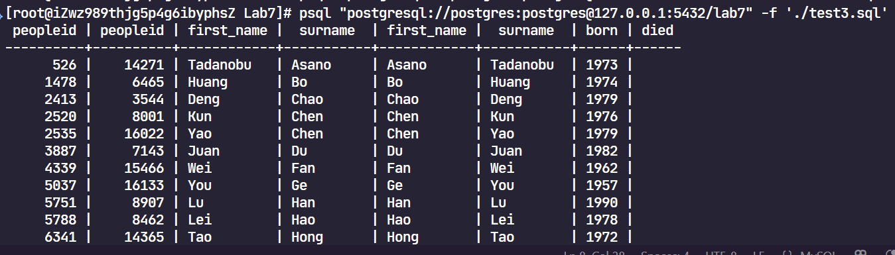
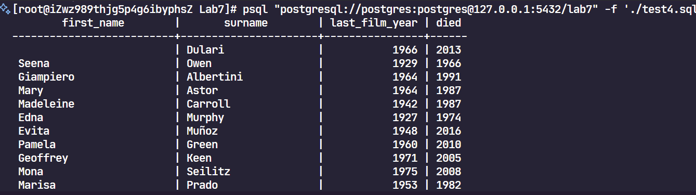
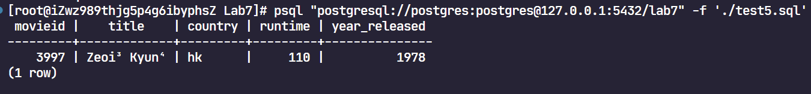
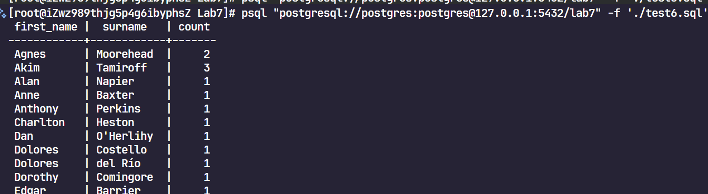
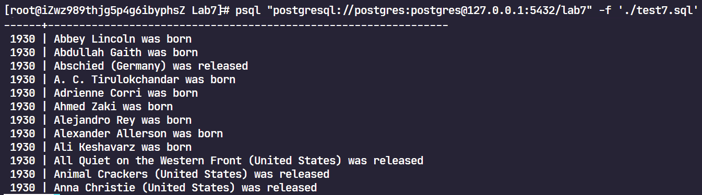
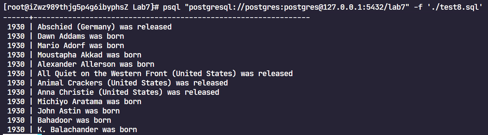
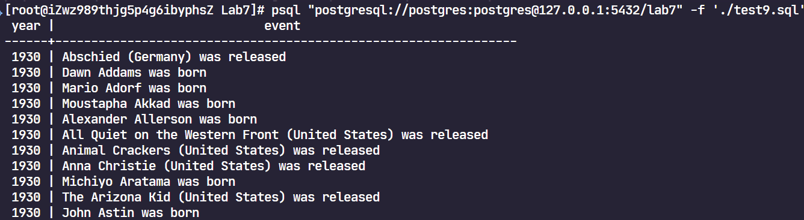
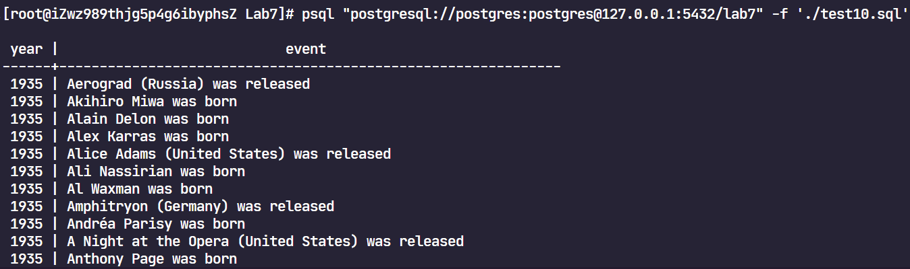
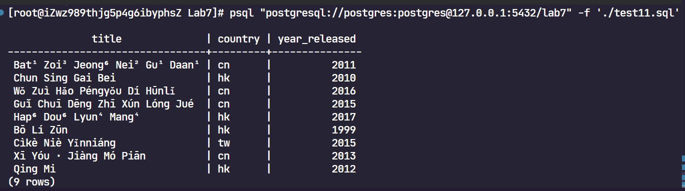

# Results - Lab7






















```sql
SELECT m.title, m.country, m.year_released
    FROM (
        SELECT c.movieid
        FROM credits c
        JOIN people p ON p.peopleid = c.peopleid
        WHERE c.credited_as = 'A'
            AND (
                (p.first_name = 'Humphrey' AND p.surname = 'Bogart')
                OR (p.first_name = 'Lauren'   AND p.surname = 'Bacall')
            )
        GROUP BY c.movieid
        HAVING COUNT(DISTINCT p.peopleid) = 2
    ) t
    JOIN movies m ON m.movieid = t.movieid
    ORDER BY m.year_released, m.title;
```

```sql
SELECT COUNT(*)
    FROM (
        SELECT c1.movieid
            FROM credits c1
            JOIN people p1 ON p1.peopleid = c1.peopleid
            WHERE c1.credited_as = 'A'
                AND p1.first_name = 'John' AND p1.surname = 'Wayne'
        INTERSECT
        SELECT c2.movieid
            FROM credits c2
            JOIN people p2 ON p2.peopleid = c2.peopleid
            WHERE c2.credited_as = 'D'
                AND p2.first_name = 'John' AND p2.surname = 'Ford'
    ) t;
```

```sql
SELECT
    p1.peopleid, p2.peopleid, p1.first_name, p1.surname, p2.first_name, p2.surname, p1.born, p1.died
    FROM people p1
        JOIN people p2
        ON      p2.first_name = p1.surname
            AND p2.surname    = p1.first_name
            AND p2.born       = p1.born
            AND p2.died IS NOT DISTINCT FROM p1.died
        WHERE p2.peopleid > p1.peopleid;
```

```sql
WITH last_film AS (
    SELECT c.peopleid, MAX(m.year_released) AS last_film_year
    FROM credits c
    JOIN movies m ON m.movieid = c.movieid
    WHERE c.credited_as = 'A'
    GROUP BY c.peopleid
)
SELECT p.first_name, p.surname, lf.last_film_year, p.died
    FROM last_film lf
    JOIN people p ON p.peopleid = lf.peopleid
    WHERE p.died IS NOT NULL
        AND p.died > lf.last_film_year + 20;
```

```cpp
WITH jc AS (
    SELECT c.movieid, m.year_released
        FROM credits c
        JOIN people p ON p.peopleid = c.peopleid
        JOIN movies m ON m.movieid  = c.movieid
        WHERE   c.credited_as = 'A'
            AND p.first_name  = 'Jackie'
            AND p.surname     = 'Chan'
),
miny AS (
    SELECT MIN(year_released) AS yr
        FROM jc
)
SELECT m.movieid, m.title, m.country, m.runtime, m.year_released
    FROM jc
    JOIN miny ON jc.year_released = miny.yr
    JOIN movies m ON m.movieid = jc.movieid
    ORDER BY m.title;
```

```cpp
WITH ow AS (
    SELECT c.movieid
        FROM credits c
        JOIN people p ON p.peopleid = c.peopleid
        WHERE   c.credited_as = 'D'
            AND p.first_name = 'Orson' AND p.surname = 'Welles'
)
SELECT p.first_name, p.surname, COUNT(DISTINCT c.movieid)
    FROM credits c
    JOIN people p ON p.peopleid = c.peopleid
    WHERE c.credited_as = 'A'
        AND c.movieid IN (SELECT movieid FROM ow)
        AND NOT (p.first_name = 'Orson' AND p.surname = 'Welles')
    GROUP BY p.first_name, p.surname
```

```cpp
SELECT yr AS year, ev AS event
    FROM (
        SELECT  m.year_released AS yr,
                m.title || ' (' || c.country_name || ') was released' AS ev
            FROM movies m
            JOIN countries c ON c.country_code = m.country
            WHERE m.year_released BETWEEN 1930 AND 1935

        UNION ALL

        SELECT  born AS yr,
                trim(coalesce(first_name, '') || ' ' || surname || ' was born') AS ev
            FROM people
            WHERE born BETWEEN 1930 AND 1935

        UNION ALL

        SELECT  died AS yr,
                trim(coalesce(first_name, '') || ' ' || surname || ' died') AS ev
            FROM people
            WHERE died BETWEEN 1930 AND 1935
    ) x
    
    ORDER BY year, event;
```

```cpp
SELECT year, event
    FROM (
        SELECT  m.year_released AS year,
                m.title || ' (' || c.country_name || ') was released' AS event,
                m.title AS sort_key
            FROM movies m
            JOIN countries c ON c.country_code = m.country
            WHERE m.year_released BETWEEN 1930 AND 1935

        UNION ALL

        SELECT  born AS year,
                trim(coalesce(first_name, '') || ' ' || surname || ' was born') AS event,
                surname AS sort_key
            FROM people
            WHERE born BETWEEN 1930 AND 1935

        UNION ALL

        SELECT  died AS year,
                trim(coalesce(first_name, '') || ' ' || surname || ' died') AS event,
                surname AS sort_key
            FROM people
            WHERE died BETWEEN 1930 AND 1935
    ) x
    ORDER BY year, sort_key;
```

```cpp
SELECT year, event
    FROM (
        SELECT  m.year_released AS year,
                m.title || ' (' || c.country_name || ') was released' AS event,
                regexp_replace(m.title, '^the[[:space:]]+', '', 'i') AS sort_key
            FROM movies m
            JOIN countries c ON c.country_code = m.country
            WHERE m.year_released BETWEEN 1930 AND 1935

        UNION ALL

        SELECT  born AS year,
                trim(coalesce(first_name, '') || ' ' || surname || ' was born') AS event,
                surname AS sort_key
            FROM people
            WHERE born BETWEEN 1930 AND 1935

        UNION ALL

        SELECT  died AS year,
                trim(coalesce(first_name, '') || ' ' || surname || ' died') AS event,
                surname AS sort_key
            FROM people
            WHERE died BETWEEN 1930 AND 1935
    ) x
    ORDER BY year, sort_key;
```

```cpp
WITH earliest_devdas AS (
    SELECT MIN(year_released) AS year
        FROM movies
        WHERE title = 'Devdas'
)
SELECT year, event
    FROM (
    SELECT  m.year_released AS year,
            m.title || ' (' || c.country_name || ') was released' AS event
        FROM movies m
        JOIN countries c ON c.country_code = m.country
        WHERE m.year_released = (SELECT year FROM earliest_devdas)

    UNION ALL

    SELECT  born AS year,
            trim(coalesce(first_name, '') || ' ' || surname || ' was born') AS event
        FROM people
        WHERE born = (SELECT year FROM earliest_devdas)

    UNION ALL

    SELECT  died AS year,
            trim(coalesce(first_name, '') || ' ' || surname || ' died') AS event
        FROM people
        WHERE died = (SELECT year FROM earliest_devdas)
    ) x
    
    ORDER BY event;
```

```cpp
SELECT m.title, m.country, m.year_released
    FROM movies m
    WHERE EXISTS (
        SELECT 1
            FROM credits c1
            JOIN people p ON p.peopleid = c1.peopleid
            WHERE   c1.movieid = m.movieid
                    AND c1.credited_as = 'A'
                    AND p.first_name = 'Qi' AND p.surname = 'Shu'
    )
    AND NOT EXISTS (
        SELECT 1
            FROM credits c2
            JOIN people p2 ON p2.peopleid = c2.peopleid
            WHERE   c2.movieid = m.movieid
                    AND c2.credited_as = 'A'
                    AND p2.first_name = 'You' AND p2.surname = 'Ge'
    );
```

