# Results - Lab8

```sql
BEGIN;

DROP TABLE IF EXISTS emp;
CREATE TABLE emp (
    id integer PRIMARY KEY,
    name varchar(30),
    age integer,
    dept_code integer,
    office_loc varchar(100),
    salary integer DEFAULT 0
);

INSERT INTO emp VALUES
    (1,'张三',22,1,'宝安',6000),
    (2,'李四',31,1,'宝安',7000),
    (3,'王五',25,2,'福田',6000),
    (4,'赵六',24,1,'宝安',5000),
    (5,'庄七',22,3,'光明',8000),
    (6,'康八',45,2,'福田',15000),
    (7,'聂九',34,3,'光明',7500),
    (8,'刘二麻子',56,4,'光明',17000),
    (9,'孙小毛',17,1,'宝安',3000),
    (10,'陈老大',37,1,'宝安',7000);
    
COMMIT;

SELECT count(*) AS tot FROM emp;

SELECT id, name, salary
    FROM emp
    ORDER BY id;

```

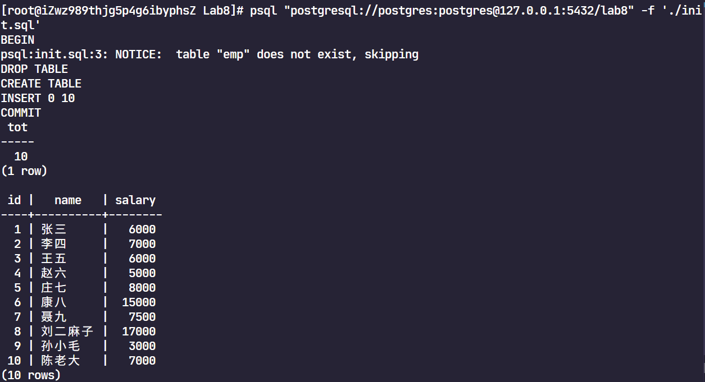

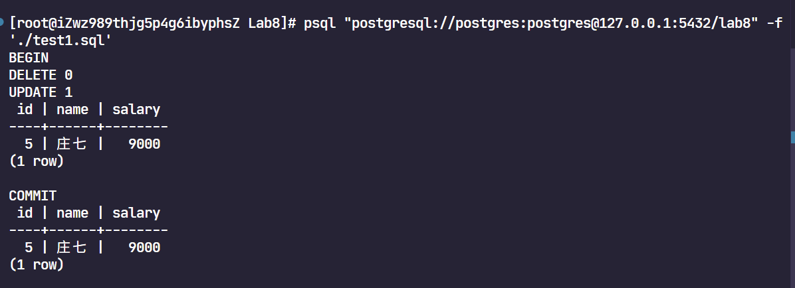

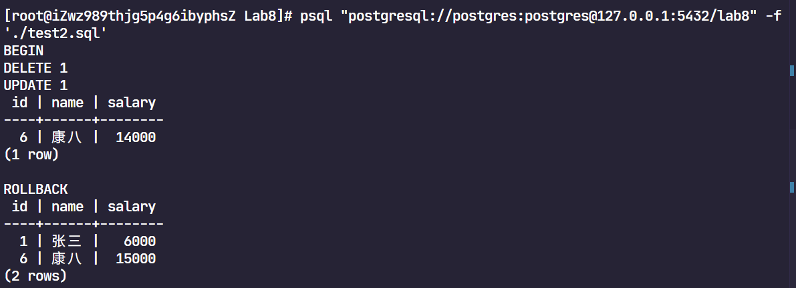

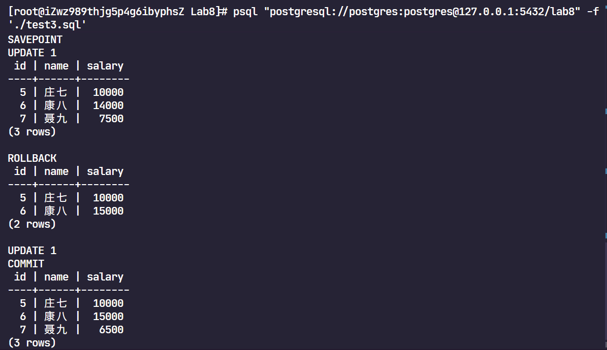

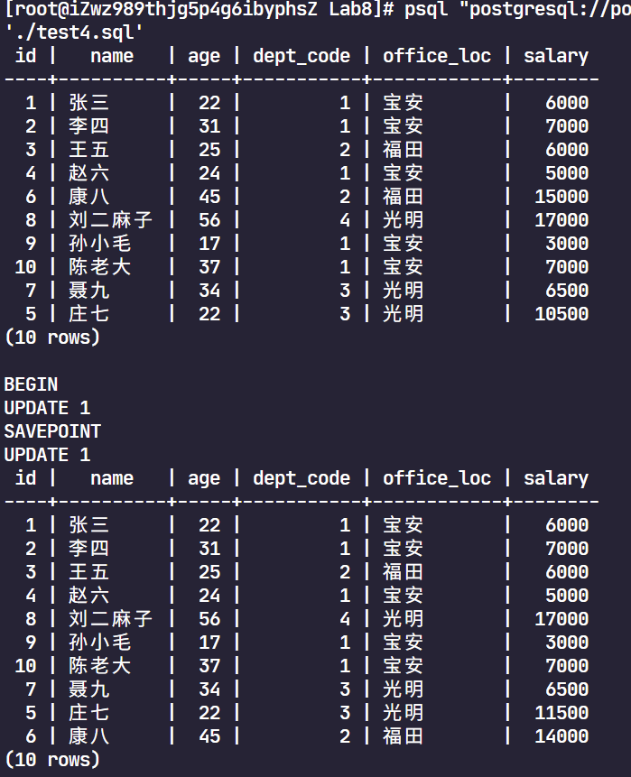

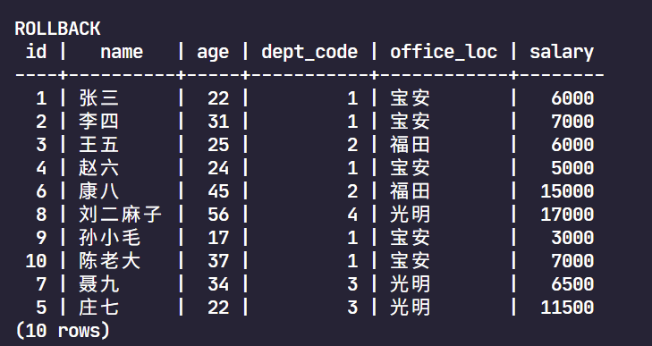

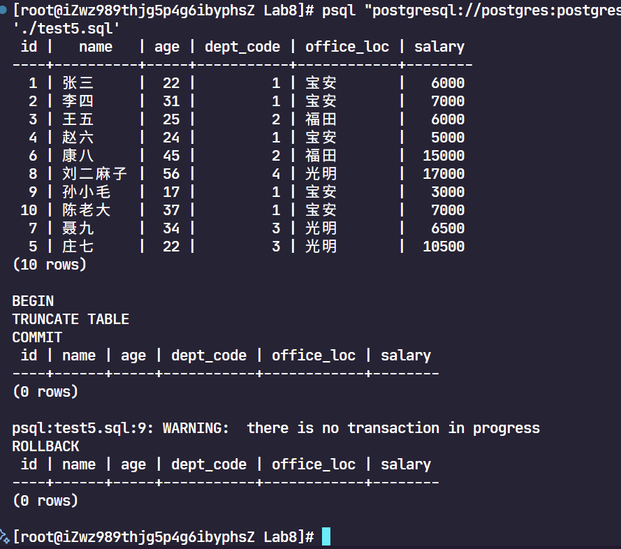

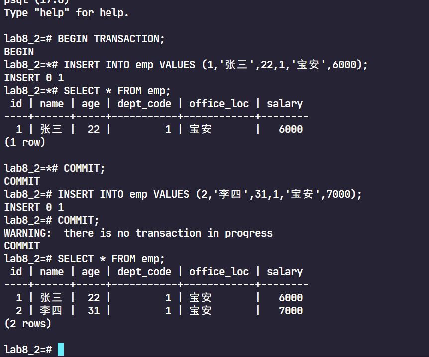

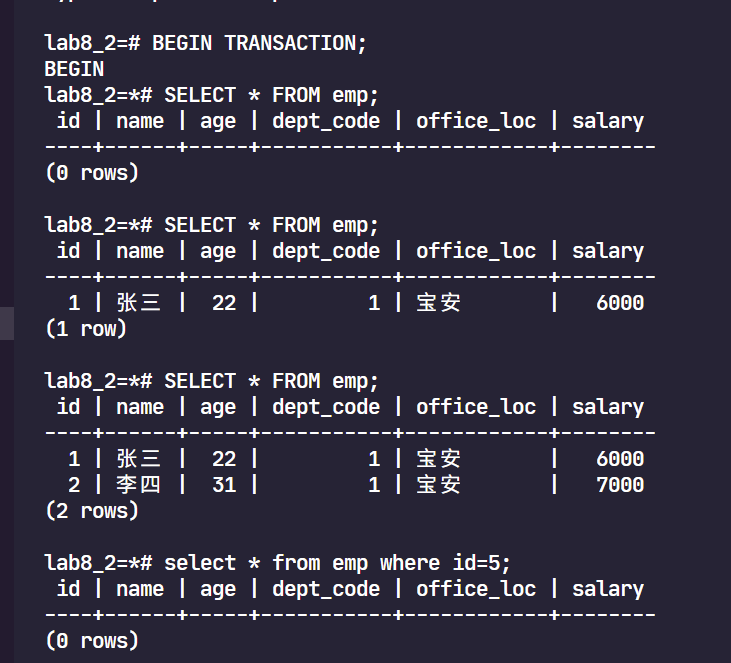

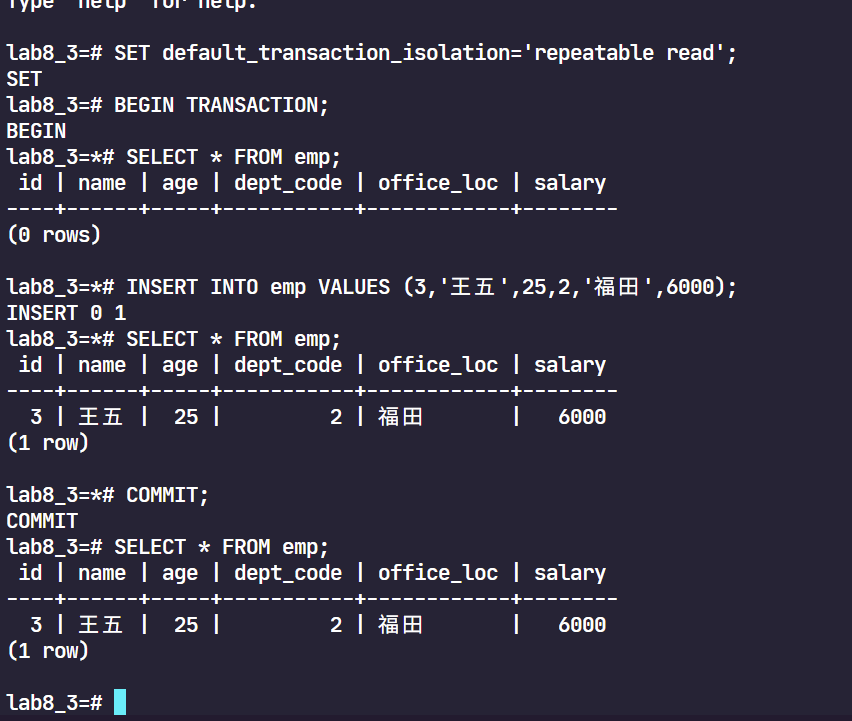

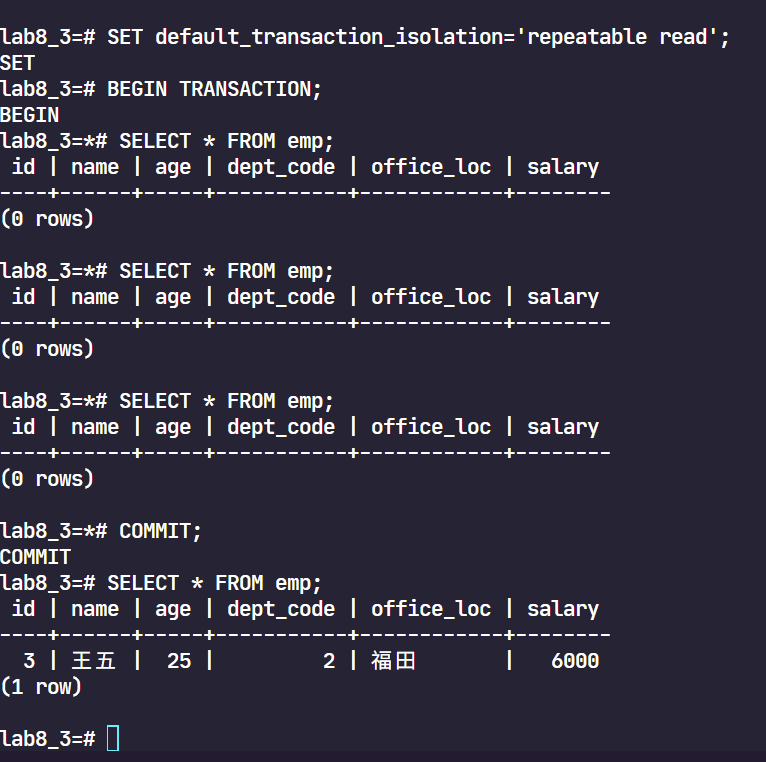

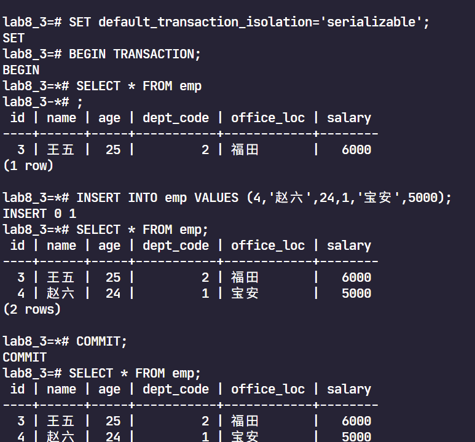

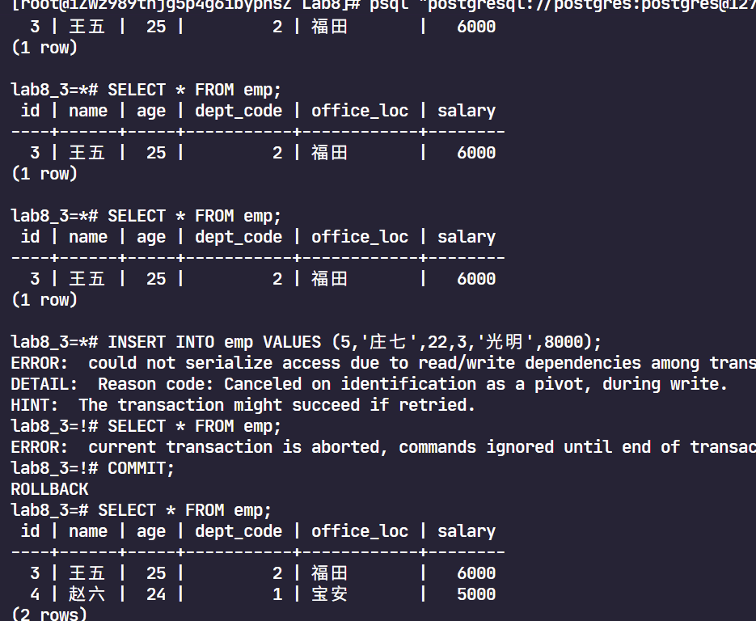
