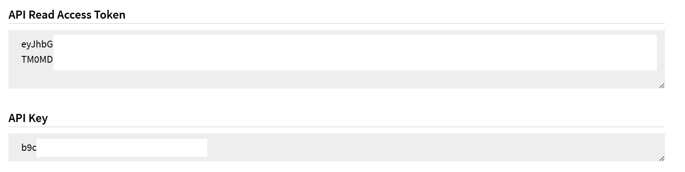
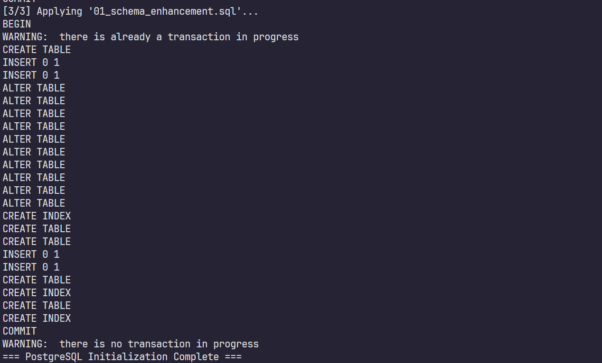
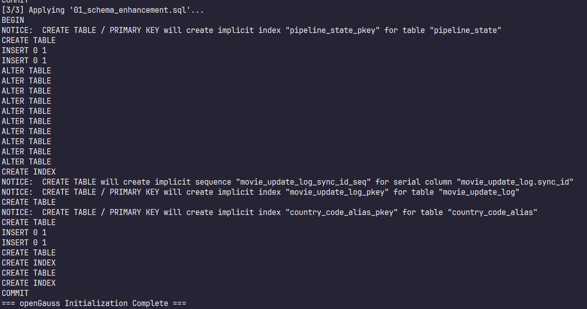
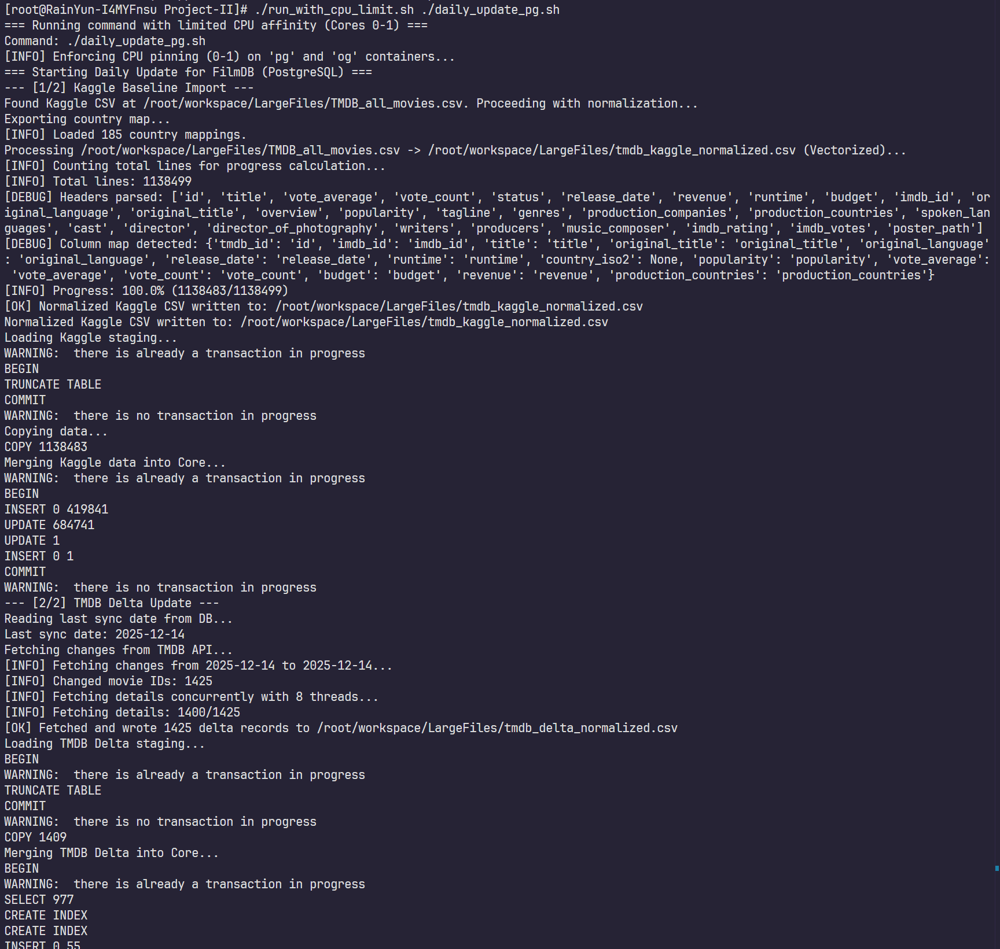
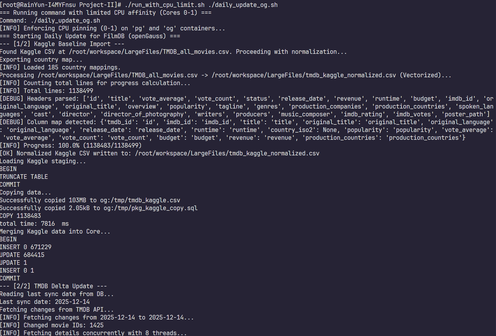
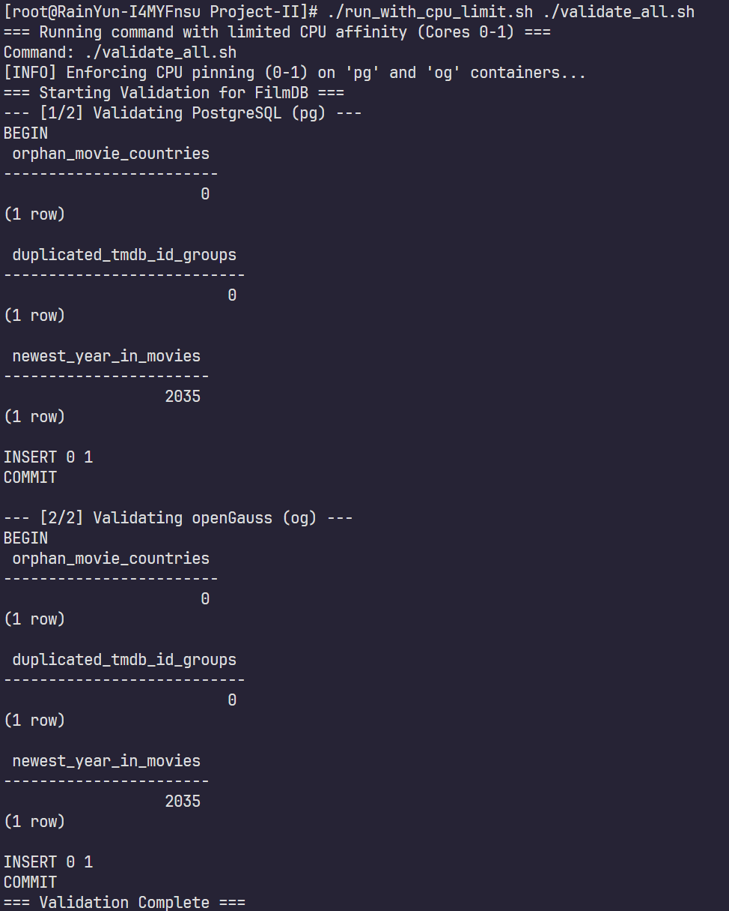
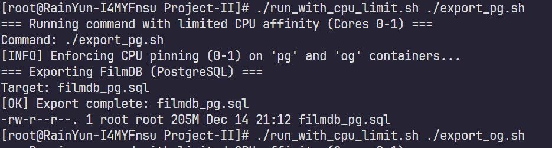
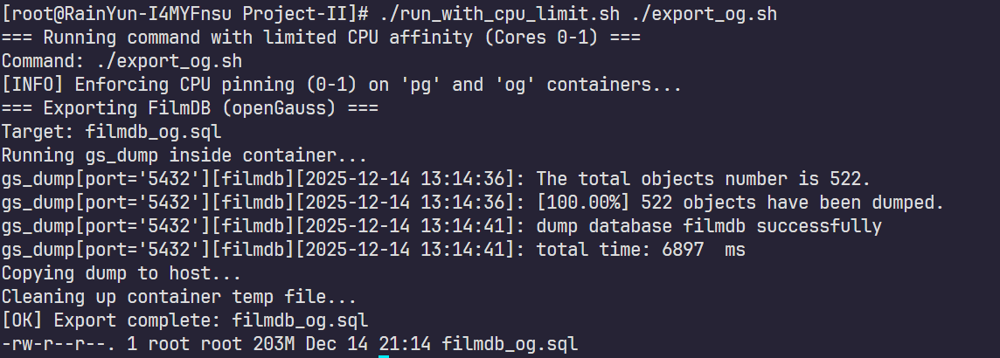
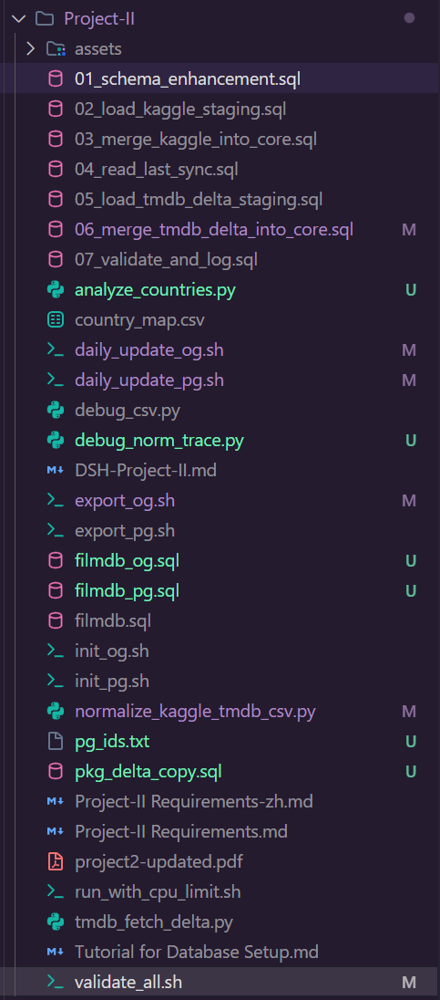

# Improve the database FilmDB and Course Materials - DSH-Project-II

[TOC]

## Publishment

[Github](https://github.com/tsawke/Database-Systems/tree/main/Project-II)

[Tsawke's Blog](http://tsawke.com/Data/Blog/content/DSH-Project-II.html)

[Luogu Blog](https://www.luogu.com.cn/article/6ywg472y)

## Tasks

### 1. Database Enhancement

### 2. Lecture Notes Review

### 3. Course Content Proposal

## Preface

The provided `filmdb.sql` includes directives like `PRAGMA` that are not compatible with PostgreSQL/openGauss, and the country codes in it are not strictly ISO-3166, and the most significant, it's not latest (only until 2019). Overall, this report aims to refresh the database and keep it latest.

## Acknowledgement

I acknowledge the use of multiple AI tools during the preparation of this report (including ChatGPT 5.2 Thinking, Gemini 3 Pro, Gemini 3 Pro (High, Antigravity), Claude Opus 4.5 (Thinking, Antigravity), GPT-5.1-codex-max (cursor), e.t.c.) to support drafting, code assistance, and language refinement. All AI-generated content was subsequently **manually reviewed, reorganized, edited, and cleaned** to ensure accuracy, originality, and clarity. Where applicable, the outputs were further **validated through practical experiments** to confirm correctness and executability.

To ensure transparency and reproducibility, the **core code has been fully disclosed**, and **execution screenshots** are included in the report, so that all presented content remains **meaningful, concise, and valuable to the reader**. In addition, as the data is used solely for research and educational purposes, the data usage and attribution comply with the relevant requirements and guidelines of sources such as **Kaggle** and **TMDB**.

## Environment

- Cloud Server

- System: CentOS 9 Stream

- Configuration:

  - 4core vCPU

  - 4GiB RAM

  - 30GiB ROM

  - 10Mbps Upload / Download

- IP: 23.141.172.26

- Location: HK

- PostgreSQL: 17.7

- openGauss: 5.0.1

- With Docker

Tips: The `Tutorial for Database Setup.pdf` is provided for installing databases in this environment.

## 1. Database Enhancement

### 1.1 Data Sources

This project requires “as new as possible”, therefore ideally updated to the day the program runs, and extensible to run daily in the future. This report provides a union plan to solve it.

#### 1.1.1 Kaggle (Daily-updated TMDB dataset)


Use a daily refreshed Kaggle dataset based on TMDB as the main baseline source.

#### 1.1.2 TMDB Official API

Kaggle is updated daily, but the program must reflect “today” whenever it runs. Therefore, TMDb official API is used as an incremental “delta” source after Kaggle import.

### 1.2 Workflow

1) Download Kaggle daily snapshot (baseline).
2) Load into staging tables.
3) Merge into FilmDB core tables (movies, countries, and any new enhancement tables).
4) Read last sync timestamp from a local metadata table.
5) Use TMDb Changes API to fetch changed IDs from last sync date to today.
6) Pull details for each changed movie ID; apply inserts/updates in a controlled transaction.
7) Validate constraints and export SQL.

### 1.3 Design

####  1.3.1 Preserve the original tables, add new tables and columns

Keep existing core tables (movies, countries, people, credits, e.t.c.). Add new columns and new tables for external identifiers and richer metadata.

#### 1.3.2 New high-utility tables

Enhance `movies` with new columns (nullable):

- `tmdb_id` (unique, nullable for legacy rows)
- `imdb_id` (nullable)
- `release_date` (nullable)
- `original_title` (nullable)
- `original_language` (nullable)
- `popularity` (nullable numeric)
- `vote_average` (nullable numeric)
- `vote_count` (nullable integer)
- `budget` (nullable bigint)
- `revenue` (nullable bigint)

Add new tables:

1) `movie_update_log(sync_id, run_ts, source, dataset_version, start_date, end_date, status, notes)` to record each update run.
2) `country_code_alias(alias_code, canonical_code)` to map ISO codes into FilmDB’s internal codes (e.g., map `es` to `sp` to avoid breaking the existing countries table).
3) `staging_movies_*` tables (temporary or persistent) to allow safe bulk imports and deterministic merges.

Principles:

- Keep the original `(title, country, year_released)` uniqueness for backward compatibility if possible.
- Add `UNIQUE (tmdb_id)` where `tmdb_id IS NOT NULL` to ensure stable identity for incremental updates.
- Use `tmdb_id` as the primary identifier; if `tmdb_id` is `NULL`, fall back to the legacy uniqueness key `(title, country, year_released)` to resolve identity and prevent duplicates.

### 1.4 Compatibility Strategy for PostgreSQL and openGauss

#### 1.4.1 Approach

Produce two SQL outputs for maximum safety:

- `filmdb_pg.sql` for PostgreSQL.
- `filmdb_og.sql` for openGauss.

Even though openGauss can run in PG compatibility mode, differences still exist (e.g. notably upsert syntax).

Generating two scripts avoids unexpected failures in real environments.

#### 1.4.2 Avoid DB-specific UPSERT syntax by using staging + merge logic

Instead of relying on PostgreSQL `ON CONFLICT` or openGauss `ON DUPLICATE KEY UPDATE`, implement portable merge logic:

1) Insert Kaggle rows into staging tables without strict constraints.
2) Normalize and deduplicate in SQL queries that use `NOT EXISTS` joins.
3) Update existing rows with deterministic rules (only update if new data is non-null and different).
   This approach works consistently across PostgreSQL and openGauss with minimal dialect differences.

### 1.5 Pipeline

This pipeline is designed to be reproducible and runnable **on any day**. Kaggle provides a daily-updated TMDb baseline snapshot, and the TMDb official API is used to catch up to “today” by applying incremental changes since the last sync date.

#### 1.5.1 One-time setup

1. Configure Kaggle API:

   - Save Kaggle token to `~/.kaggle/kaggle.json`.

   - Typical permissions requirement: `chmod 600 ~/.kaggle/kaggle.json`.

   - Download the dataset snapshot with Kaggle CLI:
     - `kaggle datasets download -d alanvourch/tmdb-movies-daily-updates -p ~/workspace/LargeFiles/ --unzip`

2. Confirm baseline CSV location:
   - The extracted Kaggle CSV is already available at `~/workspace/LargeFiles/TMDB_all_movies.csv`.

3. Configure TMDB API:

   - Obtain a TMDb API credential (API Read Access Token / Bearer token).

   - Export it for the pipeline runner:

     - `export TMDB_BEARER_TOKEN="YOUR_TOKEN_HERE"`.

     - Here's my API Read Access Token, it's necessary to apply one on `https://www.themoviedb.org/settings/api`.

       

5. Initialize DB schema enhancement (run once):

   - Apply schema extensions (new columns on `movies`, new tables `pipeline_state`, `movie_update_log`, `country_code_alias`, and staging tables).

   - This is executed by running `01_schema_enhancement.sql`.

#### 1.5.2 Daily baseline import from Kaggle

1. Normalize Kaggle CSV to a stable staging format

   - Motivation: Kaggle datasets often contain malformed quoting that breaks standard parsers. The updated script uses Python's robust `csv` standard library to pre-parse data before vectorizing with Pandas, recovering ~99% of valid records (from <10k to >670k rows).
   - Input: `~/workspace/LargeFiles/TMDB_all_movies.csv`
   - Output: `~/workspace/LargeFiles/tmdb_kaggle_normalized.csv`

2. Load Kaggle normalized CSV into staging

   - Truncate staging and load the normalized CSV into `staging_movies_kaggle`.

   - Use `02_load_kaggle_staging.sql`.
   - **PostgreSQL**: Uses client-side `\copy` for simplicity.
   - **openGauss**: Uses robust container-file-copy (`docker cp`) plus server-side `COPY` to avoid shell buffer limits and encoding issues unique to `gsql`.

3. Merge Kaggle staging into FilmDB core tables

   - Normalize and map country codes (e.g., ISO `es` mapped to FilmDB `sp`) via `country_code_alias`.
     - Insert new movies and update existing ones with deterministic rules:
       - Use `tmdb_id` as the primary identifier when available.
       - If `tmdb_id` is `NULL`, fall back to `(title, country, year_released)` as the legacy identity key.

   - Handle legacy-key collisions deterministically (e.g., if a new row’s legacy key matches an existing movie with a different `tmdb_id`, apply a traceable title suffix within length limits).

   - This is executed by `03_merge_kaggle_into_core.sql`.

4. Log baseline completion

   - Insert a success record into `movie_update_log` with `source='kaggle'` and the dataset version string if recorded.

   - This is included in `03_merge_kaggle_into_core.sql`.

#### 1.5.3 Incremental catch-up using TMDB API

1. Determine the incremental window

   - Read the last successful sync date from `pipeline_state.tmdb_last_sync`.

   - Use it as `start_date`; set `end_date` to the current date (run day).

   - This can be retrieved by running `04_read_last_sync.sql`.

2. Fetch changed movie IDs and write a TMDb delta CSV

   - Use the TMDb “Changes” endpoint to fetch changed movie IDs between `start_date` and `end_date` (chunk into <=14-day windows if needed).

   - Fetch details for each changed ID, normalize fields into a stable delta CSV.

   - Output: `~/workspace/LargeFiles/tmdb_delta_normalized.csv`.

3. Load delta CSV into staging and merge into core

   1) Load `tmdb_delta_normalized.csv` into `staging_movies_tmdb_delta` using `05_load_tmdb_delta_staging.sql`.

   1. Merge delta staging into core:

      - Insert missing movies by `tmdb_id`.

      - Update existing movies by `tmdb_id` using “fill-if-null / improve-if-empty” rules.

      - Update `pipeline_state.tmdb_last_sync` to the run day for the next one-click incremental update.

      - This is executed by `06_merge_tmdb_delta_into_core.sql`.

4. Log delta completion

   - Insert a success record into `movie_update_log` with `source='tmdb'`.

   - This is included in `06_merge_tmdb_delta_into_core.sql`.

#### 1.5.4 Data validation and integrity checks

After changes:

1) Verify referential integrity:
   - Ensure every `movies.country` exists in `countries.country_code`.

2) Verify uniqueness invariants:
   - Ensure no duplicated non-null `tmdb_id` values exist in `movies` (enforced by a unique index).

3) Verify “newest year” signal:
   - Check `MAX(year_released)` to confirm the database now extends beyond 2019.

4) Log validation results:
   - Record validation execution in `movie_update_log` for traceability.

These checks are executed by `07_validate_and_log.sql`, orchestrated by the wrapper script `validate_all.sh` which runs verify on both databases.

### 1.6 Implementation

To implement the update pipeline more conveniently and make it fully reproducible, we prepared a set of batch scripts (shell scripts) that automate the complete workflow. A specialized wrapper `run_with_cpu_limit.sh` is provided to enforce CPU affinity (pinning to cores 0-1) to prevent resource contention during intensive parallel data loading.

#### 1.6.1 Environment Preparation

Before running any scripts, ensure the following environment is ready:

- **Docker / permissions (if you run the DB in Docker)**: make sure you have permission to run Docker commands (e.g., `newgrp docker` or `sudo` privileges, depending on your system setup).
- **API tokens and input files**:
  - **Kaggle**: ensure `~/.kaggle/kaggle.json` exists, or make sure the Kaggle CSV has already been downloaded and extracted to `~/workspace/LargeFiles/`.
  - **Baseline CSV path**: the extracted Kaggle dataset CSV is expected at `~/workspace/LargeFiles/TMDB_all_movies.csv`.
  - **TMDb**: set the environment variable `TMDB_BEARER_TOKEN` before running daily updates:
    - `export TMDB_BEARER_TOKEN="your_token_here"`
- **Python dependencies**: make sure `pandas` and `requests` are installed (used for CSV normalization and TMDb delta fetching).

#### 1.6.2 Database Initialization

These scripts rebuild the `filmdb` database from scratch, load the original `filmdb.sql`, and then apply schema extensions via `01_schema_enhancement.sql`. This ensures the database contains the required staging tables, metadata tables, and the extra columns needed for the new pipeline (e.g., `tmdb_id`).

- **PostgreSQL**

```bash
./init_pg.sh
```

- **openGauss**

```bash
./init_og.sh
```

**Note:** This step will drop (delete) the existing `filmdb` database and recreate it. Do not run it if you need to preserve the current database state.

#### 1.6.3 Daily Update (Kaggle Baseline + TMDB Delta + Validation)

These scripts execute the full daily ETL process:

1. **Kaggle baseline import**
   If `~/workspace/LargeFiles/TMDB_all_movies.csv` exists, the script will automatically normalize it into a stable schema (fixed columns) and load it into staging tables, then merge into FilmDB core tables.
2. **TMDB incremental sync (delta layer)**
   The script reads the “last sync date” from the database metadata table, calls the TMDB API to fetch changes since that date up to “today”, downloads the latest details for changed movies, loads the delta into staging, and merges it into core tables.
3. **Validation**
   After merges, the script runs integrity checks (e.g., country foreign-key validity and `tmdb_id` uniqueness) and records run status in the update log.

- **PostgreSQL**

```bash
export TMDB_BEARER_TOKEN="your_token_here"
./run_with_cpu_limit.sh ./daily_update_pg.sh
```

- **openGauss**

```bash
export TMDB_BEARER_TOKEN="your_token_here"
./run_with_cpu_limit.sh ./daily_update_og.sh
```

#### 1.6.4 Export Deliverables (Final SQL Dumps)

After daily updates are complete, export the final deliverable SQL files. This produces two outputs to maximize compatibility and avoid environment-specific failures:

- **PostgreSQL export**

```bash
./run_with_cpu_limit.sh ./export_pg.sh
```

Output file: `filmdb_pg.sql`

- **openGauss export**

```bash
./run_with_cpu_limit.sh ./export_og.sh
```

Output file: `filmdb_og.sql`

#### 1.6.5 Troubleshooting

- **Permission errors**: ensure all scripts are executable:

```bash
chmod +x *.sh
```

- **Token errors**: if the daily update scripts report missing TMDB token, verify the variable is set:

```bash
echo $TMDB_BEARER_TOKEN
```

- **File not found**: ensure the baseline directory exists and contains the Kaggle CSV:
- `~/workspace/LargeFiles/`
- `~/workspace/LargeFiles/TMDB_all_movies.csv`

If the baseline CSV is missing, re-download the Kaggle dataset and confirm it is extracted to the expected location before running the daily update scripts.

### 1.7 Results

#### 1.7.1 `init_pg.sh`



#### 1.7.2 `init_og.sh`



#### 1.7.3 `daily_update_pg.sh`



#### 1.7.4 `daily_update_og.sh`



#### 1.7.5 `validate_all.sh`



#### 1.7.6 `export_pg.sh`



#### 1.7.7 `export_og.sh`



#### 1.7.8 Ultimate Files



---

## 2. Lecture Notes Review

### 2.1 CS213 Lecture-01 CS213-DB-01.pdf

#### 2.1.1 Slides Updates

##### 2.1.1.1 Page 3

**Replace with**

- Use textbooks and official docs first. If you use an LLM, treat it as a drafting assistant and verify with primary sources and experiments.
- Validate claims by running small SQL tests.

##### 2.1.1.2 Page 14

**Change**

- Remove wealth ranking and net worth claims.
- Keep Oracle founder and Oracle DB historical impact.

##### 2.1.1.3 Pages 15–16

**Fix**

- Yahoo PNuts → Yahoo PNUTS

##### 2.1.1.4 Page 25

**Replace with**

- Relational model: relations are unordered.
- SQL: result order is unspecified unless `ORDER BY` is used.
  Link: [PostgreSQL ORDER BY](https://www.postgresql.org/docs/current/queries-order.html)

##### 2.1.1.5 Page 26

**Replace with**

- Theory: relations are sets; duplicate tuples are not meaningful.
- SQL: duplicates may exist unless prevented by constraints; `DISTINCT` removes duplicates in query results.

##### 2.1.1.6 Pages 29–36

**Add one slide after Page 36**

- PRIMARY KEY enforces uniqueness and NOT NULL.
- UNIQUE prevents duplicates.
- FOREIGN KEY enforces referential integrity.

##### 2.1.1.7 Pages 38–40

**Replace with two concepts**

- Data cleaning and standardization: consistent capitalization, date formats, codes, units, validation, deduplication.
- Schema normalization: 1NF, 2NF, 3NF reduce redundancy and update anomalies.
  Link: [Microsoft normalization description](https://learn.microsoft.com/en-us/troubleshoot/microsoft-365-apps/access/database-normalization-description)

##### 2.1.1.8 Page 41

**Replace with**

- 1NF: no repeating groups; attributes are atomic for the purpose.
- Splitting names is often useful for querying but depends on application requirements.

##### 2.1.1.9 Pages 61–64

**Change**

- Replace confusing geopolitical code examples with a neutral dependency example such as `zipcode → city → state`.
- Model historical codes using a reference table when history matters.

##### 2.1.1.10 Page 74

**Replace definitions with**

- 2NF: in 1NF, and no partial dependency of any non-key attribute on part of a composite key.
- 3NF: in 2NF, and no transitive dependency among non-key attributes.

Link: [OpenTextBC normalization](https://opentextbc.ca/dbdesign01/chapter/chapter-12-normalization/)

##### 2.1.1.11 Pages 76–83

**Add one slide after Page 83**

- Entity becomes table.
- 1:N becomes foreign key on the many side.
- M:N becomes junction table with composite primary key and two foreign keys.

#### 2.1.2 openGauss insertion

1. **Insert after Page 11 (DBMS introduction)**
   **Reason**: The lecture introduces “DBMS” but gives no modern concrete system example; openGauss provides a locally relevant, PostgreSQL-like relational DBMS for later demos and labs.
   Link: [openGauss overview](https://docs.opengauss.org/en/docs/3.1.1/docs/BriefTutorial/what-is-opengauss.html)

2. **Insert after Page 16 (history timeline ends at 2010s)**
   **Reason**: Timeline stops at 2010s; add 2020s trends and introduce openGauss (2020–) to keep the “history” section current.
   Link: [Huawei announcement](https://www.huawei.com/en/news/2020/7/opengauss-open-source-community)

3. **Insert after Page 25 (row order)**
   **Reason**: Students often confuse relational theory with SQL behavior; add a short openGauss query demo to reinforce “ORDER BY is required for guaranteed order”.
   Demo snippet for the new slide:

   ```sql
   SELECT title, year FROM movies;
   SELECT title, year FROM movies ORDER BY year;
   ```

   Link: [openGauss ORDER BY](https://docs.opengauss.org/en/docs/5.0.0/docs/BriefTutorial/order-by-clause.html)

   Note: openGauss may run in different compatibility modes; in PostgreSQL-like mode the behavior matches PostgreSQL, but you should still treat order as unspecified without `ORDER BY`.

4. **Insert after Page 26 (duplicates)**
   **Reason**: The slide states duplicates are forbidden, but SQL query results can contain duplicates; add openGauss demo to show `DISTINCT` and mention constraints (`PRIMARY KEY`, `UNIQUE`).
   Demo snippet for the new slide:

   ```sql
   INSERT INTO directors(firstname, surname) VALUES ('Chris','Nolan');
   INSERT INTO directors(firstname, surname) VALUES ('Chris','Nolan');
   
   SELECT firstname, surname FROM directors;
   SELECT DISTINCT firstname, surname FROM directors;
   ```

   Link: [openGauss DISTINCT](https://docs.opengauss.org/en/docs/3.1.0/docs/BriefTutorial/distinct.html)

5. **Insert after Page 36 (keys)**
   **Reason**: Keys are introduced conceptually; add one openGauss DDL slide mapping keys to real constraints, so students see “concept → SQL”.
   Demo snippet for the new slide:

   ```sql
   CREATE TABLE directors (
       director_id SERIAL PRIMARY KEY,
       firstname   TEXT NOT NULL,
       surname     TEXT NOT NULL,
       CONSTRAINT uq_director_name UNIQUE(firstname, surname)
   );
   ```

6. **Insert after Page 83 (ER modeling)**
   **Reason**: ER is taught, but students need the bridge to SQL; add an openGauss “ER → DDL” example, especially M:N junction tables.
   Demo snippet for the new slide:

   ```sql
   CREATE TABLE movie_actor (
       movie_id INT NOT NULL REFERENCES movies(movie_id),
       actor_id INT NOT NULL REFERENCES actors(actor_id),
       PRIMARY KEY (movie_id, actor_id)
   );
   ```

#### 2.1.3 References

- [openGauss overview](https://docs.opengauss.org/en/docs/3.1.1/docs/BriefTutorial/what-is-opengauss.html)
- [Huawei openGauss community launch](https://www.huawei.com/en/news/2020/7/opengauss-open-source-community)
- [openGauss ORDER BY](https://docs.opengauss.org/en/docs/5.0.0/docs/BriefTutorial/order-by-clause.html)
- [openGauss DISTINCT](https://docs.opengauss.org/en/docs/3.1.0/docs/BriefTutorial/distinct.html)
- [PostgreSQL ORDER BY ordering rule](https://www.postgresql.org/docs/current/queries-order.html)

------

### 2.2 CS213 Lecture-02 CS213-DB-02.pdf

#### 2.2.1 Slides Updates

##### 2.2.1.1 Page 9

**Fix**

- descendents → descendants

##### 2.2.1.2 Page 17

**Add after the “SQL standard exists” point**

- SQL has an ISO/IEC standard, but real systems ship dialects. Always check the DBMS manual for edge cases and extensions.
- openGauss uses a PostgreSQL-like dialect plus compatibility features.

##### 2.2.1.3 Pages 24–25

**Replace with**

- Keywords are case-insensitive.
- Identifiers depend on quoting: unquoted identifiers are folded by the system; quoted identifiers preserve case and can include spaces.
- Naming rules vary by DBMS; avoid quoted identifiers in teaching examples.

##### 2.2.1.4 Page 28

**Replace with**

- Empty string and NULL are different concepts in SQL.
- Oracle treats empty strings in text types as NULL, which is nonstandard behavior.
- In openGauss, empty string is not NULL.

##### 2.2.1.5 Pages 30–31

**Fix**

- PostreSQL → PostgreSQL

**Replace the date-time bullets with**

- DATE stores a calendar date.
- TIMESTAMP stores date and time; precision varies by product.
- Some products use DATETIME as a name; PostgreSQL and openGauss use TIMESTAMP.

##### 2.2.1.6 Page 32

**Replace the “bad CREATE TABLE” example with a clean version**

```sql
CREATE TABLE people (
    peopleid    SERIAL PRIMARY KEY,
    first_name  VARCHAR(30),
    surname     VARCHAR(30) NOT NULL,
    born        INT NOT NULL,
    died        INT,
    CONSTRAINT ck_life CHECK (died IS NULL OR died >= born)
);
```

##### 2.2.1.7 Page 36

**Add**

- Mention `COMMENT ON` works in PostgreSQL-like systems including openGauss.

##### 2.2.1.8 Page 46

**Add**

- Case-insensitive uniqueness depends on collation; demonstrate a functional unique index.

##### 2.2.1.9 Page 49

**Update**

- Replace “MySQL accepts CHECK but doesn't enforce it” with:
  - Older MySQL versions parsed CHECK but ignored it; modern MySQL enforces CHECK.
  - openGauss enforces CHECK constraints.

##### 2.2.1.10 Pages 50–53

**Add after the foreign key definition**

- Show `ON DELETE RESTRICT`, `ON DELETE CASCADE`, `ON DELETE SET NULL`.
- Remind students referenced columns must be PRIMARY KEY or UNIQUE.

##### 2.2.1.11 Page 60

**Replace with**

- Use single quotes for strings.
- Double quotes are for identifiers in standard SQL and in openGauss.

##### 2.2.1.12 Page 63

**Add**

- Prefer standard escaping by doubling single quotes.
- Avoid backslash escaping in portable SQL examples.

##### 2.2.1.13 Pages 65–66

**Replace with**

- Prefer ISO dates `YYYY-MM-DD`.
- For portability, use `DATE '1969-07-20'` or explicit formatting with `to_date`.

#### 2.2.2 openGauss insertion

1. **Insert after Page 17 (SQL standard vs dialects)**
   **Reason**: Students need one concrete dialect target; openGauss is a PostgreSQL-like dialect and fits the lecture’s “dialects” message.
   Link: [openGauss overview](https://docs.opengauss.org/en/docs/3.1.1/docs/BriefTutorial/what-is-opengauss.html)

2. **Insert after Pages 24–25 (identifiers and naming)**
   **Reason**: Quoting and case rules vary by product; add openGauss guidance to avoid teaching “quoted identifiers everywhere” habits.
   Suggested note: “Prefer lowercase snake_case; avoid quoted names unless required.”

3. **Insert after Page 28 (NULL vs empty string)**
   **Reason**: Oracle’s empty-string-as-NULL is a common confusion point; add a one-line openGauss contrast so students don’t generalize Oracle behavior.

4. **Insert after Pages 30–31 (date/time types)**
   **Reason**: The lecture mentions DATETIME vs TIMESTAMP; add an openGauss mapping slide so students know what to use in openGauss.

5. **Insert after Pages 50–53 (constraints and foreign keys)**
   **Reason**: This is where students decide “do I actually enforce rules?”; add openGauss examples to show CHECK/UNIQUE/FK are real and enforceable.
   Demo snippet for the new slide:

   ```sql
   CREATE TABLE countries (
       country_code CHAR(2) PRIMARY KEY,
       country_name TEXT NOT NULL UNIQUE
   );
   
   CREATE TABLE movies (
       movieid        INT PRIMARY KEY,
       title          TEXT NOT NULL,
       country        CHAR(2) NOT NULL REFERENCES countries(country_code) ON DELETE RESTRICT,
       year_released  INT NOT NULL CHECK (year_released >= 1895),
       UNIQUE (title, country, year_released)
   );
   ```

6. **Insert after Pages 65–66 (INSERT, quoting, dates)**
   **Reason**: This is where students write lots of literals; add openGauss “safe quoting + ISO date” examples to reduce beginner errors.
   Demo snippet for the new slide:

   ```sql
   INSERT INTO movies(movieid, title, country, year_released)
   VALUES (1, 'L''Avventura', 'it', 1960);
   
   SELECT CURRENT_DATE, CURRENT_TIMESTAMP;
   ```

#### 2.2.3 References

- [openGauss overview](https://docs.opengauss.org/en/docs/3.1.1/docs/BriefTutorial/what-is-opengauss.html)
- [PostgreSQL CREATE TABLE](https://www.postgresql.org/docs/current/sql-createtable.html)
- [PostgreSQL constraints](https://www.postgresql.org/docs/current/ddl-constraints.html)
- [PostgreSQL date and time types](https://www.postgresql.org/docs/current/datatype-datetime.html)

- https://www.postgresql.org/docs/current/datatype-datetime.html)

### 2.3 CS213 Lecture-03 CS213-DB-03.pdf

#### 2.3.1 Slides Updates

##### 2.3.1.1 Page 9

**Replace with**

- String literals must use **single quotes**: `where surname = 'Han'`.
- Unquoted text is treated as an **identifier** (column/table name), not a string.
- Double quotes are for **identifiers** in standard SQL (PostgreSQL/openGauss), not for strings.

##### 2.3.1.2 Page 11

**Fix**

- `==` → `=` in SQL examples.

**Replace the derived-table example with a clean version**

```sql
SELECT *
FROM (
    SELECT *
    FROM movies
    WHERE country = 'us'
) AS us_movies
WHERE year_released BETWEEN 1940 AND 1949;
```

##### 2.3.1.3 Page 13

**Fix**

- performance-wise (use consistent hyphenation)

**Add**

- Note: rewriting queries into nested filters may be equivalent logically, but may differ in performance depending on the optimizer.

##### 2.3.1.4 Page 14

**Add**

- Avoid comparing dates as strings; store/use proper date types and cast explicitly when needed.
- Prefer ISO dates (`YYYY-MM-DD`) to avoid ambiguous formats.

##### 2.3.1.5 Page 15

**Add**

- Operator precedence reminder: `AND` binds tighter than `OR`. Use parentheses to avoid mistakes.

##### 2.3.1.6 Page 23

**Add**

- Suggest using `IN (...)` for readability, but still encourage parentheses for mixed `AND/OR` conditions.

##### 2.3.1.7 Page 26

**Fix**

- casesensitive → case-sensitive

**Replace with**

- Case sensitivity depends on collation/DBMS settings.
- If you need case-insensitive matching, prefer an explicit case-insensitive operator (when available) instead of duplicating conditions.

##### 2.3.1.8 Page 27

**Fix**

- performancewise → performance-wise

**Replace with**

- Applying functions like `upper(title)` inside `WHERE` can prevent index usage.
- Prefer case-insensitive operators or functional indexes when needed.

##### 2.3.1.9 Pages 29–31

**Replace with**

- Date formats can be ambiguous across regions; prefer ISO input.
- When converting strings to dates, always specify the format (avoid relying on DB defaults).

##### 2.3.1.10 Pages 33–36

**Replace with**

- For timestamp/datetime columns, avoid `=` comparisons to a date-only literal.
- Teach a safe “whole-day” filter using a half-open interval:
  - `ts >= DATE '2021-03-02' AND ts < DATE '2021-03-03'`

##### 2.3.1.11 Page 55

**Replace with**

- These are **tool/DBMS-specific** describe commands (not standard SQL):
  - MySQL: `DESC table;`
  - PostgreSQL/openGauss (gsql): `\d table`
  - SQLite: `.schema table`

##### 2.3.1.12 Page 57

**Fix the concatenation examples**

- Show complete, correct forms:
  - Standard-ish: `'hello' || ' world'`
  - SQL Server: `'hello' + ' world'`
  - MySQL/openGauss (also supported widely): `concat('hello', ' world')`

##### 2.3.1.13 Page 58

**Replace with**

- Always cast explicitly when mixing numbers and strings.
- Use `AS` for readability.

```sql
SELECT
    title || ' was released in ' || CAST(year_released AS varchar) AS movie_release
FROM movies
WHERE country = 'us';
```

##### 2.3.1.14 Page 65

**Fix**

- `round(3.141592, 3)` → `3.142`
- `trunc(3.141592, 3)` → `3.141`

##### 2.3.1.15 Pages 72–73 and 78–79

**Replace with**

- Always include an `ELSE` branch (otherwise the result can be `NULL`).
- Prefer “searched CASE” (`CASE WHEN ...`) for NULL checks and realistic conditions.
- Avoid long, unrealistic enumerations (e.g., one `WHEN` per year); use conditions like `died IS NULL`.

#### 2.3.2 openGauss insertion

1. **Insert after Page 9 (string vs identifier quoting)**
   **Reason**: Students copy quoting habits early; openGauss follows PostgreSQL-style quoting (single quotes for strings, double quotes for identifiers).
   Link: [gsql Tool Reference](https://docs.opengauss.org/en/docs/3.0.0/docs/Toolreference/gsql.html)

2. **Insert after Pages 26–27 (case-insensitive matching, performance)**
   **Reason**: The lecture warns that `upper(title)` in `WHERE` is slow; openGauss provides `ILIKE` as the explicit solution. Also, openGauss Dolphin compatibility can change `LIKE` behavior, so teach `ILIKE` to be unambiguous.
   Demo snippet:

   ```sql
   SELECT *
   FROM movies
   WHERE title ILIKE '%a%';
   ```

   Link: [Mode Matching Operators](https://docs.opengauss.org/en/docs/5.0.0/docs/SQLReference/mode-matching-operators.html)
   Link: [Dolphin Character Processing Functions and Operators](https://docs.opengauss.org/en/docs/5.1.0/docs/ExtensionReference/dolphin-character-processing-functions-and-operators.html)

3. **Insert after Pages 29–31 (ISO dates + parsing)**
   **Reason**: Date input defaults vary by DBMS; openGauss students should learn ISO literals and explicit parsing.
   Demo snippet:

   ```sql
   SELECT DATE '2018-03-12';
   SELECT to_date('12 March, 2018', 'DD Month, YYYY');
   ```

   Link: [Date and Time Functions and Operators](https://docs.opengauss.org/en/docs/5.0.0/docs/BriefTutorial/date-time-functions-and-operators.html)

4. **Insert after Pages 33–36 (timestamp “whole-day” filtering)**
   **Reason**: This is a frequent real-world bug; add one openGauss example showing the half-open interval pattern.
   Demo snippet:

   ```sql
   SELECT *
   FROM issues
   WHERE issued >= DATE '2021-03-02'
     AND issued <  DATE '2021-03-03';
   ```

   Link: [Date and Time Functions and Operators](https://docs.opengauss.org/en/docs/5.0.0/docs/BriefTutorial/date-time-functions-and-operators.html)

5. **Insert after Page 55 (how to inspect tables in openGauss)**
   **Reason**: Students need an actionable “inspect schema” workflow for the course DBMS.
   Demo snippet:

   ```sql
   -- in gsql
   \d movies
   \dt
   
   -- portable SQL alternative
   SELECT column_name, data_type
   FROM information_schema.columns
   WHERE table_name = 'movies'
   ORDER BY ordinal_position;
   ```

   Link: [gsql Tool Reference](https://docs.opengauss.org/en/docs/3.0.0/docs/Toolreference/gsql.html)
   Link: [Meta-Command Reference](https://docs.opengauss.org/en/docs/3.1.1-lite/docs/Toolreference/meta-command-reference.html)

6. **Insert after Pages 78–79 (CASE for NULL labeling)**
   **Reason**: Connect CASE to a simple reporting task and reinforce correct NULL handling in openGauss.
   Demo snippet:

   ```sql
   SELECT surname,
          CASE
              WHEN died IS NULL THEN 'Alive'
              ELSE 'Deceased'
          END AS status
   FROM people;
   ```

   Link: [Expressions](https://docs.opengauss.org/en/docs/3.0.0/docs/BriefTutorial/expressions.html)

#### 2.3.3 References

- [Mode Matching Operators](https://docs.opengauss.org/en/docs/5.0.0/docs/SQLReference/mode-matching-operators.html)
- [Dolphin Character Processing Functions and Operators](https://docs.opengauss.org/en/docs/5.1.0/docs/ExtensionReference/dolphin-character-processing-functions-and-operators.html)
- [Date and Time Functions and Operators](https://docs.opengauss.org/en/docs/5.0.0/docs/BriefTutorial/date-time-functions-and-operators.html)
- [gsql Tool Reference](https://docs.opengauss.org/en/docs/3.0.0/docs/Toolreference/gsql.html)
- [Meta-Command Reference](https://docs.opengauss.org/en/docs/3.1.1-lite/docs/Toolreference/meta-command-reference.html)
- [Expressions](https://docs.opengauss.org/en/docs/3.0.0/docs/BriefTutorial/expressions.html)

### 2.4 CS213 Lecture-04 CS213-DB-04.pdf

#### 2.4.1 Slides Updates

##### 2.4.1.1 Page 3

**Replace with**

- Relational theory treats relations as **sets** (no duplicates).
- SQL result sets are often **multisets** (duplicates may appear).
- Use `DISTINCT` only when you need set semantics, and explain the cost trade-off.

##### 2.4.1.2 Page 7

**Fix**

- keywork → keyword

**Add**

- `DISTINCT` applies to the **whole selected row**. With multiple columns, it removes rows where **all selected columns** match.

##### 2.4.1.3 Pages 14–15

**Replace with**

- `WHERE` can stream rows early; `DISTINCT` and `GROUP BY` often require additional work before producing results.
- Implementation is not always “sorting”: many DBMSs can use **hash-based** distinct/aggregation as well.

##### 2.4.1.4 Page 16

**Update**

- Replace `stddev()` with standard-style names:
  - `stddev_pop(...)`, `stddev_samp(...)` (common in PostgreSQL-like systems, including openGauss).
- Keep the message “functions differ by DBMS”, but avoid presenting `stddev()` as universal.

##### 2.4.1.5 Page 19

**Add**

- Clarify purpose:
  - `WHERE` filters **rows before grouping**
  - `HAVING` filters **groups after aggregation**

##### 2.4.1.6 Page 21

**Replace with**

- Do not rely on a DBMS “fixing” an inefficient query form.
- Prefer pushing filters into `WHERE` when possible for clarity and performance, and use `HAVING` only for aggregate conditions.

##### 2.4.1.7 Page 22

**Add**

- Add one practical note: use `EXPLAIN` (or the DBMS equivalent) to see how the optimizer plans joins and aggregations.

##### 2.4.1.8 Pages 23–27

**Replace with**

- Most aggregates ignore `NULL` inputs, but `COUNT(*)` counts **rows**.
- Show the key distinction explicitly:
  - `COUNT(*)` = number of rows
  - `COUNT(col)` = number of non-NULL values in `col`

##### 2.4.1.9 Pages 33 and 67

**Fix**

- Complete the unfinished subquery placeholders so students can run the full query end-to-end.

**Replace with a complete version**

```sql
SELECT COUNT(*) AS number_of_acting_directors
FROM (
    SELECT peopleid
    FROM (
        SELECT DISTINCT peopleid, credited_as
        FROM credits
        WHERE credited_as IN ('A', 'D')
    ) AS t
    GROUP BY peopleid
    HAVING COUNT(*) = 2
) AS acting_directors;
```

##### 2.4.1.10 Page 45

**Fix**

- talbe → table

##### 2.4.1.11 Page 43

**Replace with**

- Conceptually, an inner join equals “Cartesian product + filter”.
- In practice, DBMSs do not materialize the full product; they use join algorithms (hash join, merge join, nested loops).

##### 2.4.1.12 Page 49

**Update**

- NATURAL JOIN is part of standard SQL and is supported by some systems, but it is still a bad default for teaching because it depends on column names and can break when schemas evolve.
- Recommend: explicit `JOIN ... ON ...` with clear keys.

##### 2.4.1.13 Page 53

**Replace with**

- Keep the cross-DBMS note, but remove informal wording.
- Use one consistent teaching style: table aliases + `JOIN ... ON ...`.

##### 2.4.1.14 Pages 68–69

**Replace with**

- Comma joins are historical and still supported, but are easy to get wrong.
- Teach explicit join syntax:
  - `INNER JOIN ... ON ...`
  - Use `CROSS JOIN` only when you truly want a Cartesian product.

#### 2.4.2 openGauss insertion

1. **Insert after Page 6 (DISTINCT basics)**
   **Reason**: The lecture introduces `DISTINCT` but lacks a concrete course DBMS demo; add an openGauss runnable example and reinforce “row-level distinctness”.
   Demo snippet:

   ```sql
   SELECT DISTINCT country
   FROM movies
   WHERE year_released = 2000;
   
   SELECT DISTINCT country, year_released
   FROM movies
   WHERE year_released IN (2000, 2001);
   ```

   Link: [openGauss DISTINCT](https://docs.opengauss.org/en/docs/3.1.0/docs/BriefTutorial/distinct.html)

2. **Insert after Page 13 (GROUP BY syntax rule)**
   **Reason**: Students commonly select non-aggregated columns that are not in `GROUP BY`; add an openGauss example showing the correct pattern.
   Demo snippet:

   ```sql
   SELECT country,
          COUNT(*) AS number_of_movies
   FROM movies
   GROUP BY country;
   ```

   Link: [openGauss GROUP BY Clause](https://docs.opengauss.org/en/docs/5.0.0/docs/BriefTutorial/group-by-clause.html)

3. **Insert after Page 19 (HAVING vs WHERE)**
   **Reason**: The lecture introduces `HAVING`, but students confuse it with `WHERE`; add a short openGauss “before vs after grouping” demo.
   Demo snippet:

   ```sql
   SELECT country,
          MIN(year_released) AS oldest_movie
   FROM movies
   GROUP BY country
   HAVING MIN(year_released) < 1940;
   ```

   Link: [openGauss HAVING Clause](https://docs.opengauss.org/en/docs/5.0.0/docs/BriefTutorial/having-clause.html)

4. **Insert after Page 22 (optimizer visibility)**
   **Reason**: The slides mention optimizers differ; add one openGauss tool students can use to observe plans and costs.
   Demo snippet:

   ```sql
   EXPLAIN
   SELECT country, COUNT(*)
   FROM movies
   GROUP BY country;
   ```

   Link: [openGauss EXPLAIN](https://docs.opengauss.org/en/docs/5.0.0/docs/SQLReference/explain.html)

5. **Insert after Page 27 (COUNT differences with NULLs)**
   **Reason**: The lecture explains the concept, but a small openGauss demo makes it stick and prevents common mistakes in analytics queries.
   Demo snippet:

   ```sql
   SELECT COUNT(*) AS total_rows,
          COUNT(died) AS non_null_died
   FROM people;
   ```

   Link: [openGauss Aggregate Functions](https://docs.opengauss.org/en/docs/5.0.0/docs/BriefTutorial/aggregate-functions.html)

6. **Insert after Page 54 (JOIN with aliases as the default style)**
   **Reason**: The lecture shows multiple syntaxes (NATURAL/USING/ON); standardize on the safest teaching pattern for openGauss labs.
   Demo snippet:

   ```sql
   SELECT DISTINCT p.first_name, p.surname
   FROM people AS p
   JOIN credits AS c
       ON c.peopleid = p.peopleid
   WHERE c.credited_as = 'D';
   ```

   Link: [openGauss JOIN Clause](https://docs.opengauss.org/en/docs/5.0.0/docs/BriefTutorial/join-clause.html)

7. **Insert after Page 69 (avoid accidental Cartesian products)**
   **Reason**: The lecture warns about forgetting join predicates; add an openGauss-specific habit: always write explicit joins, and use `CROSS JOIN` only intentionally.
   Demo snippet:

   ```sql
   SELECT COUNT(*)
   FROM movies m
   CROSS JOIN countries c;
   ```

   Link: [openGauss JOIN Clause](https://docs.opengauss.org/en/docs/5.0.0/docs/BriefTutorial/join-clause.html)

#### 2.4.3 References

- [openGauss DISTINCT](https://docs.opengauss.org/en/docs/3.1.0/docs/BriefTutorial/distinct.html)
- [openGauss GROUP BY Clause](https://docs.opengauss.org/en/docs/5.0.0/docs/BriefTutorial/group-by-clause.html)
- [openGauss HAVING Clause](https://docs.opengauss.org/en/docs/5.0.0/docs/BriefTutorial/having-clause.html)
- [openGauss EXPLAIN](https://docs.opengauss.org/en/docs/5.0.0/docs/SQLReference/explain.html)
- [openGauss Aggregate Functions](https://docs.opengauss.org/en/docs/5.0.0/docs/BriefTutorial/aggregate-functions.html)
- [openGauss JOIN Clause](https://docs.opengauss.org/en/docs/5.0.0/docs/BriefTutorial/join-clause.html)

### 2.5 CS213 Lecture-05 CS213-DB-05.pdf

#### 2.5.1 Slides Updates

##### 2.5.1.1 Page 10

**Replace with**

- Books often present LEFT/RIGHT/FULL outer joins. In practice, **LEFT OUTER JOIN is the default teaching choice** because it reads naturally.
- **RIGHT OUTER JOIN** is equivalent to swapping table order and using LEFT OUTER JOIN.
- **FULL OUTER JOIN** is less common but still useful for “show all rows from both sides”.

##### 2.5.1.2 Page 16

**Replace with**

- `COALESCE()` is **widely supported** across DBMSs and returns the first non-NULL argument.
- Use it for numeric outputs (counts, sums) where showing `0` is clearer than `NULL`.

##### 2.5.1.3 Page 18

**Replace with**

- Join predicates should usually be **equality on keys** (e.g., FK = PK).
- Using `<>` in a join predicate often creates many unintended matches and can explode row counts.

##### 2.5.1.4 Pages 21–27

**Add**

- Outer-join rule of thumb: putting a condition on the **outer-joined table** in the `WHERE` clause can turn a LEFT JOIN into an INNER JOIN by filtering out NULL-extended rows.
- Prefer placing such conditions in the `ON` clause (or in a subquery) when you want to keep unmatched rows.

##### 2.5.1.5 Page 29

**Replace with a simpler “correct” solution**

```sql
    SELECT
        m.year_released,
        m.title,
        p.first_name,
        p.surname
    FROM movies m
    LEFT OUTER JOIN credits c
        ON c.movieid = m.movieid
       AND c.credited_as = 'D'
    LEFT OUTER JOIN people p
        ON p.peopleid = c.peopleid
    WHERE m.country = 'gb';
```

##### 2.5.1.6 Page 32

**Replace with**

- If both branches query the **same table** with simple predicates, `OR` is often simpler.
- Use `UNION`/`UNION ALL` when combining results from different queries/tables, or when it improves readability.

##### 2.5.1.7 Pages 35–36

**Add**

- `UNION` removes duplicates and can be expensive.
- `UNION ALL` keeps all rows (no dedup) and is usually faster.
- Use `UNION ALL` when duplicates are meaningful (counts, logs, time partitions).

##### 2.5.1.8 Pages 38–41

**Replace the placeholder subquery with a complete version**

```sql
    SELECT
        x.movieid,
        SUM(x.view_count) AS view_count
    FROM (
        SELECT
            'last year' AS period,
            movieid,
            SUM(view_count) AS view_count
        FROM last_year_data
        GROUP BY movieid
        UNION ALL
        SELECT
            'this year' AS period,
            movieid,
            SUM(view_count) AS view_count
        FROM current_year_data
        GROUP BY movieid
    ) x
    GROUP BY x.movieid;
```

##### 2.5.1.9 Page 47

**Fix the broken INTERSECT example**

```sql
    SELECT country_code
    FROM countries
    INTERSECT
    SELECT DISTINCT country
    FROM movies;
```

##### 2.5.1.10 Pages 44 and 50

**Add**

- Standard SQL uses `EXCEPT`; Oracle calls the same idea `MINUS`.
- In this course (openGauss), use `EXCEPT`.

##### 2.5.1.11 Page 66

**Replace with**

- `IN (subquery)` behaves like membership testing; **duplicates in the subquery do not change the truth value**.
- Add `DISTINCT` only for clarity or to reduce work when duplicates are likely.

##### 2.5.1.12 Pages 76–79

**Add**

- `NOT IN (...)` is unsafe if the subquery can produce `NULL` (it can eliminate all rows).
- Prefer `NOT EXISTS`, or filter `NULL` explicitly in the subquery.

##### 2.5.1.13 Page 81

**Replace with**

- Avoid correlated `IN` when possible; **prefer `EXISTS/NOT EXISTS`** for correlated logic because it makes intent clearer and avoids NULL traps.

##### 2.5.1.14 Page 85

**Add**

- In `EXISTS`, the subquery’s `SELECT` list is irrelevant; `SELECT 1` is a common, clear convention (instead of `SELECT NULL`).

#### 2.5.2 openGauss insertion

1. **Insert after Page 10 (outer join types in openGauss)**
   **Reason**: The slide claims only LEFT OUTER JOIN matters; openGauss supports LEFT/RIGHT/FULL, so students should learn the full vocabulary and the “rewrite RIGHT as LEFT” habit.
   Link: [JOIN (CROSS/INNER/LEFT/RIGHT/FULL)](https://docs.opengauss.org/en/docs/3.1.0/docs/BriefTutorial/join.html)

2. **Insert after Page 16 (COALESCE in openGauss)**
   **Reason**: This is the practical “show 0 instead of NULL” moment; add the official openGauss function reference to match what students will run in labs.
   Demo snippet:

   ```sql
       SELECT
           c.country_name,
           COALESCE(x.number_of_movies, 0) AS number_of_movies
       FROM countries c
       LEFT OUTER JOIN (
           SELECT
               country AS country_code,
               COUNT(*) AS number_of_movies
           FROM movies
           GROUP BY country
       ) x
           ON x.country_code = c.country_code;
   ```

   Link: [COALESCE](https://docs.opengauss.org/en/docs/6.0.0/docs/SQLReference/condition-expressions.html)

3. **Insert after Page 27 (outer join filter placement in openGauss)**
   **Reason**: The “outer join killer” is a frequent beginner bug; show the correct openGauss pattern: move the filter into `ON`.
   Demo snippet:

   ```sql
       SELECT
           m.title,
           p.surname
       FROM movies m
       LEFT OUTER JOIN credits c
           ON c.movieid = m.movieid
          AND c.credited_as = 'D'
       LEFT OUTER JOIN people p
           ON p.peopleid = c.peopleid
       WHERE m.country = 'gb';
   ```

   Link: [SELECT (JOIN nesting rules)](https://docs.opengauss.org/en/docs/7.0.0-RC2/docs/SQLReference/select.html)

4. **Insert after Page 36 (UNION vs UNION ALL in openGauss)**
   **Reason**: Students often default to `UNION` and accidentally lose rows; openGauss supports `UNION ALL` and documents the required column/type matching.
   Link: [UNION Clause](https://docs.opengauss.org/en/docs/3.1.1/docs/BriefTutorial/union-clause.html)

5. **Insert after Page 51 (INTERSECT/EXCEPT naming and use in openGauss)**
   **Reason**: The slides mention `EXCEPT / MINUS`; openGauss uses `EXCEPT` and supports set-operation type resolution similarly to `UNION`.
   Link: [UNION, CASE, and Related Constructs](https://docs.opengauss.org/en/docs/5.1.0/docs/SQLReference/union-case-and-related-constructs.html)

6. **Insert after Page 79 (safe anti-join: NOT EXISTS in openGauss)**
   **Reason**: `NOT IN` + `NULL` is a real production pitfall; openGauss documents `EXISTS/NOT EXISTS` directly.
   Demo snippet:

   ```sql
       SELECT p.*
       FROM people p
       WHERE NOT EXISTS (
           SELECT 1
           FROM people p2
           WHERE p2.born < 1950
             AND p2.first_name = p.first_name
       );
   ```

   Link: [Subquery Expressions (EXISTS/NOT EXISTS)](https://docs.opengauss.org/en/docs/6.0.0/docs/SQLReference/subquery-expressions.html)

#### 2.5.3 References

- [JOIN (CROSS/INNER/LEFT/RIGHT/FULL)](https://docs.opengauss.org/en/docs/3.1.0/docs/BriefTutorial/join.html)
- [UNION Clause](https://docs.opengauss.org/en/docs/3.1.1/docs/BriefTutorial/union-clause.html)
- [Subquery Expressions (EXISTS/NOT EXISTS)](https://docs.opengauss.org/en/docs/6.0.0/docs/SQLReference/subquery-expressions.html)
- [COALESCE](https://docs.opengauss.org/en/docs/6.0.0/docs/SQLReference/condition-expressions.html)
- [SELECT (JOIN nesting rules)](https://docs.opengauss.org/en/docs/7.0.0-RC2/docs/SQLReference/select.html)
- [UNION, CASE, and Related Constructs](https://docs.opengauss.org/en/docs/5.1.0/docs/SQLReference/union-case-and-related-constructs.html)

### 2.6 CS213 Lecture-06 CS213-DB-06.pdf

#### 2.6.1 Slides Updates

##### 2.6.1.1 Pages 3–9

**Add**

- SQL does not guarantee row order unless `ORDER BY` is present.
- When you need deterministic output, add a tie-breaker (e.g., `ORDER BY year_released, movieid`).

##### 2.6.1.2 Page 11

**Replace with**

- NULL ordering is DBMS-dependent.
- Prefer explicit control when teaching portability: `NULLS FIRST` / `NULLS LAST`.

##### 2.6.1.3 Page 14

**Replace with**

- Collation defines locale-specific string ordering.
- Teach portable syntax first: `ORDER BY col COLLATE "..."` (DBMS must support the named collation).
- Keep the “Chinese collation choice” question as a discussion prompt, but add: “Answer depends on OS/ICU/DB build and installed locales.”

##### 2.6.1.4 Page 15

**Add**

- Never sort by a formatted date string; sort by the original date/time column (you may still display the formatted value).

Example to add:

```sql
SELECT
    to_char(a_date_column, 'MM/DD/YYYY') AS event_date,
    other_cols
FROM some_table
ORDER BY a_date_column;
```

##### 2.6.1.5 Pages 17–18

**Replace with**

- Add an `ELSE` branch so unknown codes don’t become NULL and float unexpectedly in ordering.
- Add a secondary order for stable ties.

```sql
ORDER BY
    CASE credited_as
        WHEN 'D' THEN 1
        WHEN 'P' THEN 2
        WHEN 'A' THEN 3
        ELSE 99
    END,
    postid;
```

##### 2.6.1.6 Pages 22–26

**Add**

- Offset pagination is easy but can get slower as `OFFSET` grows; mention “keyset pagination” as the scalable alternative.
- For teaching clarity: “Sort first, then limit” is the mental model across dialects (LIMIT / FETCH FIRST / TOP).

##### 2.6.1.7 Pages 33–35

**Replace with**

- Materialized path needs a concrete, fixed-width encoding; replace `<formated id>` with an explicit padding function and include a delimiter.

```sql
ORDER BY concat(coalesce(path, ''), lpad(postid::text, 9, '0'), '.');
```

**Add**

- Mark `CONNECT BY` as Oracle-specific and point students to recursive CTEs as the general SQL approach.

##### 2.6.1.8 Page 37

**Update**

- Replace “not available in MySQL before 8 or SQLite” with:
  - “Window functions were missing in older versions of some DBMSs; always check the product/version.”

##### 2.6.1.9 Pages 52–53

**Fix (incomplete queries): Replace with a complete version**

```sql
SELECT
    country_name,
    cnt AS number_of_movies,
    round(100.0 * cnt / sum(cnt) OVER (), 0) AS percentage
FROM (
    SELECT
        c.country_name,
        coalesce(m.cnt, 0) AS cnt
    FROM countries c
    LEFT JOIN (
        SELECT country, count(*) AS cnt
        FROM movies
        GROUP BY country
    ) m
        ON m.country = c.country_code
) q
ORDER BY country_name;
```

**Add**

- Note: with `ORDER BY`, the engine must see all rows before returning the first row, so computing totals via window functions often has small incremental cost.

##### 2.6.1.10 Pages 60 and 67

**Fix (broken SQL layout): Replace with a clean version**

```sql
SELECT
    title,
    country,
    year_released,
    row_number() OVER (
        PARTITION BY country
        ORDER BY year_released DESC
    ) AS rn
FROM movies;
```

**Fix (incomplete “top 2 per country” query): Replace with**

```sql
SELECT
    x.country,
    x.title,
    x.year_released
FROM (
    SELECT
        country,
        title,
        year_released,
        row_number() OVER (
            PARTITION BY country
            ORDER BY year_released DESC, movieid DESC
        ) AS rn
    FROM movies
) x
WHERE x.rn <= 2;
```

#### 2.6.2 openGauss insertion

1. **Insert after Page 11 (NULL ordering)**
   **Reason**: The slides say NULL ordering is DBMS-dependent; add an openGauss demo showing explicit `NULLS FIRST/LAST` to avoid surprises across systems.
   Demo snippet for the new slide:

```sql
SELECT
    title,
    year_released
FROM movies
ORDER BY year_released ASC NULLS LAST;
```

Link: [openGauss ORDER BY Clause](https://docs.opengauss.org/en/docs/5.0.0/docs/BriefTutorial/order-by-clause.html)

1. **Insert after Page 14 (collation)**
   **Reason**: The slide uses Oracle-flavored examples; add an openGauss-friendly note that PostgreSQL-like systems use `COLLATE`, and collation availability depends on installed locales.
   Suggested note: “Use `COLLATE` when locale-specific ordering matters; test on the target server.”
2. **Insert after Pages 22–26 (top-N and pagination)**
   **Reason**: Students will implement paging immediately; add an openGauss example for `LIMIT/OFFSET` and a brief warning about large offsets.
   Demo snippet for the new slide:

```sql
SELECT
    title,
    country,
    year_released
FROM movies
ORDER BY title
LIMIT 10 OFFSET 20;
```

Link: [openGauss ORDER BY Clause](https://docs.opengauss.org/en/docs/5.0.0/docs/BriefTutorial/order-by-clause.html)

1. **Insert after Pages 33–35 (hierarchies)**
   **Reason**: The lecture shows `CONNECT BY` (Oracle-specific) and mentions recursive queries next; add one openGauss slide that uses `WITH RECURSIVE` as the portable approach.
   Demo snippet for the new slide:

```sql
WITH RECURSIVE thread AS (
    SELECT postid, answered_postid, message, 1 AS depth
    FROM forum_posts
    WHERE answered_postid IS NULL
  UNION ALL
    SELECT p.postid, p.answered_postid, p.message, t.depth + 1
    FROM forum_posts p
    JOIN thread t
        ON p.answered_postid = t.postid
)
SELECT *
FROM thread
ORDER BY depth, postid;
```

1. **Insert after Pages 52–53 (percentage of total)**
   **Reason**: The slide’s main query is incomplete; add a runnable openGauss version so students can copy/paste and verify `sum(...) over ()`.
   Demo snippet for the new slide: use the completed query from Section 2.6.1.9.
2. **Insert after Pages 60–67 (top-N per group)**
   **Reason**: This is a high-value pattern (“top K per category”); add an openGauss slide with a clean `row_number()` solution and one sentence on tie behavior (`row_number` vs `dense_rank`).
   Demo snippet for the new slide: use the completed query from Section 2.6.1.10.

#### 2.6.3 References

- [openGauss Overview](https://docs.opengauss.org/en/docs/3.1.1/docs/BriefTutorial/what-is-opengauss.html)
- [openGauss ORDER BY Clause](https://docs.opengauss.org/en/docs/5.0.0/docs/BriefTutorial/order-by-clause.html)
- [PostgreSQL ORDER BY](https://www.postgresql.org/docs/current/queries-order.html)
- [PostgreSQL Window Functions](https://www.postgresql.org/docs/current/tutorial-window.html)

### 2.7 CS213 Lecture-07 CS213-DB-07.pdf

#### 2.7.1 Slides Updates

##### 2.7.1.1 Pages 8–12

**Add**

- State explicitly that the “index table” approach is a teaching simplification; in practice, many DBMSs provide built-in full-text search plus indexes.

##### 2.7.1.2 Page 9

**Fix**

- The `CREATE TABLE movie_title_ft_index` snippet is not valid SQL; replace with a complete DDL.

  CREATE TABLE movie_title_ft_index (
  title_word VARCHAR(30) NOT NULL,
  movieid INT NOT NULL,
  PRIMARY KEY (title_word, movieid),
  FOREIGN KEY (movieid) REFERENCES movies(movieid)
  );

##### 2.7.1.3 Page 20

**Fix**

- sceneries → scenes
- Something may happy → Something may happen

##### 2.7.1.4 Page 21

**Fix**

- transfering → transferring
- saving account → savings account

##### 2.7.1.5 Page 23

**Change**

- Replace `runoobdb=#` with a neutral prompt like `db=#` (or `openGauss=#` if demonstrating openGauss).

##### 2.7.1.6 Page 26

**Replace with**

- Concurrency: the DBMS prevents conflicting updates to the same rows; reads vs writes depend on isolation and the DBMS concurrency model (avoid implying “everything is blocked”).

##### 2.7.1.7 Page 28

**Fix**

- commited → committed

**Add**

- Many tools behave as “commit each statement” unless an explicit `BEGIN` starts a transaction.

##### 2.7.1.8 Page 29

**Fix**

- mine field → minefield

**Add**

- Add a one-line openGauss note: like PostgreSQL, DDL can run inside a transaction and can be rolled back.

##### 2.7.1.9 Page 37

**Replace with**

- Many DBMSs support multi-row `INSERT ... VALUES (...), (...)`. SQLite supports this; Oracle uses different multi-row patterns (for example, `INSERT ALL` or `INSERT ... SELECT`).

##### 2.7.1.10 Page 38

**Add**

- Strong teaching rule: always specify the column list in `INSERT` statements (safer than relying on `SELECT *` order).

##### 2.7.1.11 Pages 54–59

**Replace with**

- For PostgreSQL-like systems (including openGauss), prefer `INSERT ... RETURNING` to retrieve generated identifiers, instead of session-wide “last generated value” functions.

##### 2.7.1.12 Page 68

**Fix**

- The text says “one column to receive every field,” but the example defines multiple columns; rephrase as “a staging table mirroring the file columns (often using TEXT first, then cast/clean).”

##### 2.7.1.13 Pages 70–73, 80–82

**Fix**

- Remove stray spaces in file paths (e.g., `us_movie_info. txt`) to avoid copy/paste failures in demos.

#### 2.7.2 openGauss insertion

1. **Insert after Page 12 (full-text search overview)**
   **Reason**: The lecture builds a manual word-index table; add one slide showing openGauss has built-in full-text search operators/functions so students see the “real” approach. ([docs.opengauss.org](https://docs.opengauss.org/en/docs/5.0.0/docs/SQLReference/text-search-functions-and-operators.html?utm_source=chatgpt.com))
   Link: [openGauss Text Search Functions and Operators](https://docs.opengauss.org/en/docs/5.0.0/docs/SQLReference/text-search-functions-and-operators.html)
   Demo snippet for the new slide:

   ```
    SELECT movieid, title
    FROM movies
    WHERE to_tsvector('simple', title) @@ to_tsquery('simple', 'space & odyssey & 2001');
   ```

2. **Insert after Page 28 (autocommit warning)**
   **Reason**: Students using openGauss should practice explicit transactions in `gsql`, aligned with the “Beware of autocommit” message. ([docs.opengauss.org](https://docs.opengauss.org/en/docs/1.0.1/docs/Toolreference/gsql.html?utm_source=chatgpt.com))
   Link: [openGauss gsql Tool](https://docs.opengauss.org/en/docs/1.0.1/docs/Toolreference/gsql.html)
   Demo snippet for the new slide:

   ```
    BEGIN;
    DELETE FROM movies WHERE movieid = 25;
    ROLLBACK;
   ```

3. **Insert after Page 29 (DDL and commits differ by DBMS)**
   **Reason**: The slide highlights portability risk; add one openGauss example to show PostgreSQL-like “DDL is transactional” behavior in a concrete way.
   Demo snippet for the new slide:

   ```
    BEGIN;
    CREATE TABLE ddl_demo(id INT);
    ROLLBACK;
   ```

4. **Insert after Page 46 (sequence function syntax)**
   **Reason**: The lecture lists multiple syntaxes; add the openGauss function form and one key rule (currval/lastval require nextval in the session). ([docs.opengauss.org](https://docs.opengauss.org/en/docs/6.0.0/docs/SQLReference/sequence-functions.html?utm_source=chatgpt.com))
   Link: [openGauss Sequence Functions](https://docs.opengauss.org/en/docs/6.0.0/docs/SQLReference/sequence-functions.html)

5. **Insert after Page 59 (retrieving generated IDs)**
   **Reason**: Replace the “last generated value” habit with the clearer, safer openGauss pattern: `RETURNING`. ([docs.opengauss.org](https://docs.opengauss.org/en/docs/6.0.0/docs/SQLReference/insert.html?utm_source=chatgpt.com))
   Link: [openGauss INSERT Statement](https://docs.opengauss.org/en/docs/6.0.0/docs/SQLReference/insert.html)
   Demo snippet for the new slide:

   ```
    INSERT INTO movies(title)
    VALUES ('Some Movie Title')
    RETURNING movieid;
   ```

6. **Insert after Page 82 (PostgreSQL COPY / psql \copy)**
   **Reason**: The lecture mentions PostgreSQL `COPY` and `\copy`; add the openGauss `gsql \copy` equivalent so students can import local files without server-side file access. ([docs.opengauss.org](https://docs.opengauss.org/en/docs/2.0.0/docs/Developerguide/using-a-gsql-meta-command-to-import-data.html?utm_source=chatgpt.com))
   Link: [openGauss gsql \copy Meta-Command](https://docs.opengauss.org/en/docs/2.0.0/docs/Developerguide/using-a-gsql-meta-command-to-import-data.html)
   Demo snippet for the new slide:

   ```
    \copy us_movie_info
    FROM 'us_movie_info.csv'
    WITH (FORMAT csv);
   ```

#### 2.7.3 References

- [openGauss Text Search Functions and Operators](https://docs.opengauss.org/en/docs/5.0.0/docs/SQLReference/text-search-functions-and-operators.html)
- [openGauss Basic Text Matching](https://docs.opengauss.org/en/docs/6.0.0/docs/SQLReference/basic-text-matching.html)
- [openGauss INSERT Statement](https://docs.opengauss.org/en/docs/6.0.0/docs/SQLReference/insert.html)
- [openGauss Sequence Functions](https://docs.opengauss.org/en/docs/6.0.0/docs/SQLReference/sequence-functions.html)
- [openGauss gsql Tool](https://docs.opengauss.org/en/docs/1.0.1/docs/Toolreference/gsql.html)
- [openGauss gsql \copy Meta-Command](https://docs.opengauss.org/en/docs/2.0.0/docs/Developerguide/using-a-gsql-meta-command-to-import-data.html)
- [openGauss Importing Data](https://docs.opengauss.org/en/docs/6.0.0/docs/DatabaseOMGuide/importing-data.html)

### 2.8 CS213 Lecture-08 CS213-DB-08.pdf

#### 2.8.1 Slides Updates

##### 2.8.1.1 Page 3

**Fix**

- `lets'` → `let's`.

##### 2.8.1.2 Page 4

**Fix**

- “Update is the command **than** changes …” → “UPDATE is the command **that** changes column values …”.

##### 2.8.1.3 Page 8

**Replace with**

- Avoid row-by-row update loops when a single set-based `UPDATE` can do the job.
- If batching is needed, batch intentionally (by key ranges / chunks) and measure.

##### 2.8.1.4 Pages 10–12

**Add**

- When updating from another table, explicitly decide how to handle:
  - no match (leave as-is vs set to NULL),
  - multiple matches (must be made unique).

##### 2.8.1.5 Pages 15–16

**Fix**

- Replace the broken `UPDATE ... FROM` example with a correct, runnable version.

```sql
UPDATE movies_2 AS m
SET duration = i.duration,
    color = CASE i.color
        WHEN 'C' THEN 'Y'
        WHEN 'B' THEN 'N'
        ELSE NULL
    END
FROM us_movie_info AS i
WHERE m.country = 'us'
  AND i.title = m.title
  AND i.year_released = m.year_released;
```

##### 2.8.1.6 Page 24

**Replace with**

- `UPDATE ... FROM` can produce nondeterministic results if one target row matches multiple source rows. Teach students to enforce uniqueness (constraints) or pre-aggregate.

##### 2.8.1.7 Pages 25–26

**Replace with**

- Primary keys are usually treated as immutable identifiers in practice, but SQL does not magically forbid key updates.
- If a key must change, teach the policy choice: use surrogate keys, or use foreign keys with an explicit `ON UPDATE ...` rule.

##### 2.8.1.8 Pages 27–29

**Tighten**

- Make the “UPSERT” message explicit: there is no single universal syntax; products differ (`MERGE`, MySQL-style upsert, SQLite-style replace).
- Add one warning: the `ON (...)` match condition should correspond to a declared unique key to avoid accidental multi-matches.

##### 2.8.1.9 Page 33

**Add**

- A safe habit: `BEGIN;` → run `DELETE/UPDATE` → verify affected rows → `COMMIT;` or `ROLLBACK;`.

##### 2.8.1.10 Page 35

**Replace with**

- Remove “TRUNCATE … cannot be rolled back” as a general rule.
- Replace with:
  - TRUNCATE is fast because it deallocates data pages rather than scanning rows.
  - It takes strong locks; use carefully and deliberately.

##### 2.8.1.11 Pages 36–39

**Fix**

- “prevent you **to** do that” → “prevent you **from** doing that”.

**Add**

- Show `ON DELETE RESTRICT | CASCADE | SET NULL` as explicit design choices (not implied behavior).

##### 2.8.1.12 Page 41

**Replace with**

- “SQLite, not a true DBMS” → “SQLite is an embedded database engine with a different feature set (for example, server-side programmability differs from PostgreSQL-like systems).”

##### 2.8.1.13 Pages 44–47

**Fix**

- The function example contains typos; keep one clean final version.

```sql
CREATE OR REPLACE FUNCTION full_name(the_name varchar)
RETURNS varchar
AS $$
BEGIN
    RETURN CASE
        WHEN position(',' IN the_name) > 0 THEN
            trim(' ' FROM substr(the_name, position(',' IN the_name) + 1))
            || ' ' ||
            trim(')' FROM substr(the_name, 1, position(',' IN the_name) - 1))
        ELSE
            the_name
    END;
END;
$$ LANGUAGE plpgsql;
```

##### 2.8.1.14 Pages 49–55

**Replace with**

- “A function shouldn’t query the database” → “Avoid scalar lookup functions that execute extra queries per row; prefer joins. Functions can read tables, but use them carefully for performance.”

##### 2.8.1.15 Page 56

**Replace with**

- If you mention LLM tools, align with an academic workflow:
  - use official docs and small tests to verify generated SQL.

#### 2.8.2 openGauss insertion

1. **Insert after Page 12 (set-based update patterns)**
   **Reason**: The slides focus on correlated subqueries; add the openGauss-friendly `UPDATE ... FROM` pattern as the default approach.
   Link: [UPDATE Statement](https://docs.opengauss.org/en/docs/3.1.0/docs/BriefTutorial/update-statement.html)
2. **Insert after Page 24 (duplicate join matches)**
   **Reason**: Students need one concrete rule: ensure the join keys are unique, or the update result can be unpredictable. Show “add UNIQUE or pre-aggregate” as the fix.
   Link: [UPDATE Statement](https://docs.opengauss.org/en/docs/3.1.0/docs/BriefTutorial/update-statement.html)
3. **Insert after Page 27 (MERGE as standard UPSERT)**
   **Reason**: Confirm MERGE support and highlight the “match condition should be key-like” rule.
   Link: [MERGE INTO Statement Guide](https://docs.opengauss.org/en/docs/1.0.0/docs/Developerguide/updating-and-inserting-data-by-using-the-merge-into-statement.html)
4. **Insert after Page 29 (dialect differences for UPSERT)**
   **Reason**: The lecture shows MySQL/SQLite syntax; add the openGauss angle: `ON DUPLICATE KEY UPDATE` requires a unique constraint or unique index.
   Link: [INSERT Guide](https://docs.opengauss.org/en/docs/1.0.0/docs/Developerguide/insert.html)
5. **Insert after Page 35 (TRUNCATE safety)**
   **Reason**: The rollback claim is risky; add a TRUNCATE slide focused on what it does (fast page release + strong locks) and when to use it.
   Link: [TRUNCATE Guide](https://docs.opengauss.org/en/docs/2.0.1/docs/Developerguide/truncate.html)
6. **Insert after Page 47 (functions and procedures)**
   **Reason**: The lecture introduces PL/pgSQL and procedures; add one minimal example for each so students can run them immediately.
   Link: [PL/pgSQL Functions](https://docs.opengauss.org/en/docs/5.0.0/docs/SQLReference/pl-pgsql-functions.html)
   Link: [CREATE PROCEDURE](https://docs.opengauss.org/en/docs/5.0.0/docs/SQLReference/create-procedure.html)

#### 2.8.3 References

- [UPDATE Statement](https://docs.opengauss.org/en/docs/3.1.0/docs/BriefTutorial/update-statement.html)
- [MERGE INTO Statement Guide](https://docs.opengauss.org/en/docs/1.0.0/docs/Developerguide/updating-and-inserting-data-by-using-the-merge-into-statement.html)
- [INSERT Guide](https://docs.opengauss.org/en/docs/1.0.0/docs/Developerguide/insert.html)
- [TRUNCATE Guide](https://docs.opengauss.org/en/docs/2.0.1/docs/Developerguide/truncate.html)
- [CREATE FUNCTION](https://docs.opengauss.org/en/docs/5.1.0/docs/SQLReference/create-function.html)
- [CREATE PROCEDURE](https://docs.opengauss.org/en/docs/5.0.0/docs/SQLReference/create-procedure.html)

### 2.9 CS213 Lecture-09 CS213-DB-09.pdf

#### 2.9.1 Slides Updates

##### 2.9.1.1 Page 1

**Fix**

- “Procedure and Triger” → “Procedure and Trigger”.

##### 2.9.1.2 Page 3

**Replace with**

- PostgreSQL supports both **functions** and **procedures** (procedures are invoked with `CALL`).
- Functions can return `void`, but a `void` function is still a function (not a procedure).

##### 2.9.1.3 Page 6

**Replace with**

- Transaction control differs by construct:
  - Functions should not manage transactions.
  - Procedures are the right unit for “business operations” and (in many systems) can manage transactions explicitly.

##### 2.9.1.4 Page 9

**Add**

- Improve parameter design: prefer stable identifiers (e.g., `country_code`, `peopleid`) over free-text names when possible; it reduces ambiguity and avoids multiple-match problems.

##### 2.9.1.5 Pages 14–16

**Update**

- Replace `lastval()` with `INSERT ... RETURNING` to avoid “wrong ID” bugs when sequences are used elsewhere in the session.

Suggested replacement snippet:

```sql
INSERT INTO movies(title, country, year_released)
SELECT p_title, country_code, p_year
FROM countries
WHERE country_name = p_country_name
RETURNING movieid
INTO n_movieid;
```

##### 2.9.1.6 Page 17

**Replace with**

- If it is a **function**, you can call it via `SELECT ...`.
- If it is a **procedure**, call it via `CALL ...`.
- `PERFORM ...` is for PL/pgSQL when you want to execute a function and ignore its return value.

##### 2.9.1.7 Pages 19–25

**Fix**

- The section is about triggers, but several slides label the topic as “Stored Proc”; rename those labels to “Trigger” for consistency.

##### 2.9.1.8 Pages 38–40

**Replace with**

- “Rollback in trigger” should be taught as: **a trigger can abort the statement/transaction by raising an error** (common across DBMSs).
- Avoid claiming only one product can roll back in a trigger; the portable idea is “raise exception / signal error”.

##### 2.9.1.9 Page 43

**Replace with**

- Use `TIMESTAMP` instead of `DATETIME` for PostgreSQL-like systems.

Suggested corrected table:

```sql
CREATE TABLE people_audit (
    auditid         SERIAL PRIMARY KEY,
    peopleid        INT NOT NULL,
    type_of_change  CHAR(1),
    column_name     VARCHAR,
    old_value       VARCHAR,
    new_value       VARCHAR,
    changed_by      VARCHAR,
    time_changed    TIMESTAMP
);
```

##### 2.9.1.10 Page 44

**Fix**

- The sample has syntax issues (broken `coalesce(...)` / cast). Replace with a clean, minimal fragment:

```sql
SELECT
    peopleid,
    'U' AS type_of_change,
    column_name,
    old_value,
    new_value,
    current_user || '@' || COALESCE(inet_client_addr()::text, 'localhost') AS changed_by,
    current_timestamp AS time_changed
FROM ...;
```

##### 2.9.1.11 Page 47

**Update**

- Replace `EXECUTE PROCEDURE people_audit_fn();` with modern PostgreSQL-style trigger syntax:

```sql
CREATE TRIGGER people_trg
AFTER INSERT OR UPDATE OR DELETE ON people
FOR EACH ROW
EXECUTE FUNCTION people_audit_fn();
```

##### 2.9.1.12 Pages 53–59

**Replace with**

- Row-level triggers are powerful, but the key rule is narrower and more accurate:
  - Avoid reading other rows of the table being modified inside a row-level trigger; intermediate states can be misleading.
  - Constraints are checked after the statement, not during each row update.

##### 2.9.1.13 Pages 63–67

**Replace with**

- “Do not query the database in functions” is too absolute. Use:
  - Avoid per-row lookup functions that execute extra queries in large queries; prefer joins or set-based logic.
  - Functions are fine for reusable expressions; procedures are better for multi-step business operations.

#### 2.9.2 openGauss insertion

1. **Insert after Page 3 (functions vs procedures)**
   **Reason**: The slide text implies PostgreSQL has only functions; add a concrete openGauss target model: functions vs procedures and how students should call each.
   Link: [CREATE PROCEDURE](https://docs.opengauss.org/en/docs/5.0.0/docs/SQLReference/create-procedure.html)
   Link: [CALL](https://docs.opengauss.org/en/docs/5.0.0/docs/SQLReference/call.html)

2. **Insert after Page 6 (transaction boundaries)**
   **Reason**: Students often try to “COMMIT inside a function”; add an openGauss note: use procedures for business operations and keep set-based SQL inside.
   Suggested note: “Use procedures for multi-step operations; keep functions lightweight and side-effect controlled.”

3. **Insert after Pages 14–16 (safe ID retrieval)**
   **Reason**: Replace `lastval()` habit with the safer pattern students can copy: `INSERT ... RETURNING` in openGauss (PostgreSQL-like).
   Link: [INSERT](https://docs.opengauss.org/en/docs/5.0.0/docs/SQLReference/insert.html)
   Demo snippet for the new slide:

   ```sql
   INSERT INTO movies(title, country, year_released)
   VALUES ('Some Title', 'us', 2001)
   RETURNING movieid;
   ```

4. **Insert after Page 17 (calling syntax)**
   **Reason**: The slide suggests calling “procedures” via `SELECT`; add openGauss examples that distinguish `SELECT fn()` vs `CALL proc()`.
   Demo snippet for the new slide:

   ```sql
   SELECT some_void_function(...);
   CALL some_procedure(...);
   ```

5. **Insert after Page 32 (trigger timing and NEW/OLD)**
   **Reason**: When students implement triggers, they need one runnable openGauss example showing `NEW` / `OLD` and timing choice.
   Link: [CREATE TRIGGER](https://docs.opengauss.org/en/docs/5.0.0/docs/SQLReference/create-trigger.html)

6. **Insert after Pages 43–47 (auditing pattern)**
   **Reason**: The lecture demonstrates auditing in PostgreSQL; add an openGauss-ready version emphasizing `TIMESTAMP`, `current_user`, and one-row-per-changed-column design.
   Link: [PL/pgSQL](https://docs.opengauss.org/en/docs/5.0.0/docs/SQLReference/pl-pgsql.html)

#### 2.9.3 References

- [CREATE PROCEDURE](https://docs.opengauss.org/en/docs/5.0.0/docs/SQLReference/create-procedure.html)
- [CALL](https://docs.opengauss.org/en/docs/5.0.0/docs/SQLReference/call.html)
- [INSERT](https://docs.opengauss.org/en/docs/5.0.0/docs/SQLReference/insert.html)
- [CREATE TRIGGER](https://docs.opengauss.org/en/docs/5.0.0/docs/SQLReference/create-trigger.html)
- [PL/pgSQL](https://docs.opengauss.org/en/docs/5.0.0/docs/SQLReference/pl-pgsql.html)
- [PostgreSQL CREATE PROCEDURE](https://www.postgresql.org/docs/current/sql-createprocedure.html)
- [PostgreSQL CREATE TRIGGER](https://www.postgresql.org/docs/current/sql-createtrigger.html)

### 2.10 CS213 Lecture-10 CS213-DB-10.pdf

#### 2.10.1 Slides Updates

##### 2.10.1.1 Page 6

**Replace with**

- Treat interface numbers as *theoretical link bandwidth*, not real DB throughput.
- Clarify units and overhead: Gb/s vs GB/s, encoding overhead, controller limits.
- Avoid hard-coding NVMe “max speed” on slides; note it depends on PCIe generation and lane count.

##### 2.10.1.2 Pages 11–15

**Update**

- Emphasize that IOPS and throughput depend on block size, queue depth, and access pattern.
- Replace “current generation” phrasing with “order-of-magnitude examples” to avoid dating the slide.

##### 2.10.1.3 Page 12

**Clarify**

- Separate “warranty/service life” from MTTF as a reliability model parameter.
- Add one line: vendor “MTTF hours” are statistical and workload-dependent; real planning uses observed failure rates and repair time assumptions.

##### 2.10.1.4 Pages 18–20

**Add**

- Add one warning line: “RAID improves availability, not a substitute for backups.”
- Add one line: independence assumptions can fail (correlated failures, rebuild window risk).

##### 2.10.1.5 Page 21

**Update**

- Note that “disk-arm scheduling” mainly targets HDD; SSDs change the cost model, but sequential I/O still matters for throughput and efficiency.

##### 2.10.1.6 Pages 32–33

**Add**

- Add one sentence that DBMS row references are typically “page + slot” to stay stable under compaction.
- Make the “slotted page” takeaway explicit: pointers should reference the slot directory, not physical byte offsets.

##### 2.10.1.7 Page 34

**Improve**

- After “PostgreSQL TOAST”, add one line explaining the idea: oversized attributes may be stored out-of-line and referenced from the main tuple.

##### 2.10.1.8 Pages 44–46

**Add**

- Add a short “index cost” reminder: indexes speed reads but add storage and write overhead.
- Make explicit that PRIMARY KEY / UNIQUE usually imply an index in PostgreSQL-like systems.

##### 2.10.1.9 Page 51

**Add**

- Add one rule of thumb: avoid redundant indexes (e.g., an index that is fully covered by the leftmost prefix of another composite index).

##### 2.10.1.10 Page 80

**Add**

- Add one line: `EXPLAIN` output is DBMS-specific; teach the invariant concepts (scan type, join type, estimated vs actual).
- If possible, show both estimated and measured forms (`EXPLAIN ANALYZE`) in the same lecture.

##### 2.10.1.11 Pages 96–102

**Fix + Clarify**

- Fix typo: insentive → insensitive.
- Clarify the principle: “functions on a column” can prevent use of a normal index, but an expression index can restore index usage when appropriate.
- Reinforce the date advice with one explicit rewrite: use range predicates instead of extracting date parts.
- Add one sentence: implicit conversions can disable indexes and change semantics; prefer explicit casts.

#### 2.10.2 openGauss insertion

1. **Insert after Page 21 (buffering and read-ahead)**
   **Reason**: Students learn storage hierarchy best when they can map it to real DB configuration knobs in a concrete system.
   Demo snippet for the new slide:

   ```sql
   SHOW shared_buffers;
   SHOW effective_cache_size;
   ```

2. **Insert after Page 33 (slotted pages and page size)**
   **Reason**: The lecture discusses pages conceptually; a one-line query makes “page size” real and testable in openGauss.
   Demo snippet for the new slide:

   ```sql
   SHOW block_size;
   SELECT current_setting('block_size');
   ```

3. **Insert after Page 46 (PK/UNIQUE create indexes “behind your back”)**
   **Reason**: This is a perfect place to prove it with a catalog query in openGauss, reinforcing that constraints usually imply indexes.
   Demo snippet for the new slide:

   ```sql
   SELECT indexname, indexdef
   FROM pg_indexes
   WHERE tablename = 'people';
   ```

4. **Insert after Page 80 (EXPLAIN)**
   **Reason**: Students need a repeatable workflow for performance: write query → EXPLAIN → change index/query → re-check. openGauss is a practical default target.
   Demo snippet for the new slide:

   ```sql
   EXPLAIN
   SELECT *
   FROM people
   WHERE surname = 'Marvin';
   
   EXPLAIN ANALYZE
   SELECT *
   FROM people
   WHERE surname = 'Marvin';
   ```

5. **Insert after Pages 96–102 (LIKE/functions/date parts/implicit casts)**
   **Reason**: The slides correctly warn about “dead indexes”, but students also need the standard fixes in a real DBMS: expression indexes, range predicates, and explicit casting.
   Demo snippet for the new slide:

   ```sql
   CREATE INDEX people_upper_surname_idx
   ON people (upper(surname));
   
   EXPLAIN
   SELECT *
   FROM people
   WHERE upper(surname) = 'MARVIN';
   
   EXPLAIN
   SELECT *
   FROM events
   WHERE date_column >= DATE '2025-06-01'
     AND date_column <  DATE '2025-07-01';
   
   EXPLAIN
   SELECT *
   FROM t
   WHERE varchar_code = CAST(12345678 AS VARCHAR);
   ```

#### 2.10.3 References

- [openGauss SQL Reference: EXPLAIN](https://docs.opengauss.org/en/docs/5.0.0/docs/SQLReference/explain.html)
- [openGauss SQL Reference: CREATE INDEX](https://docs.opengauss.org/en/docs/5.0.0/docs/SQLReference/create-index.html)
- [openGauss SQL Reference: SHOW](https://docs.opengauss.org/en/docs/5.0.0/docs/SQLReference/show.html)
- [PostgreSQL Documentation: EXPLAIN](https://www.postgresql.org/docs/current/sql-explain.html)
- [PostgreSQL Documentation: Indexes](https://www.postgresql.org/docs/current/indexes.html)

### 2.11 CS213 Lecture-11 CS213-DB-11.pdf

#### 2.11.1 Slides Updates

##### 2.11.1.1 Page 5

**Fix the syntax layout of `CREATE VIEW` (column list placement).**
**Replace with**

```sql
    CREATE VIEW viewname (col1, ..., coln)
    AS
    SELECT ... ;
```

- The optional column rename list belongs right after the view name, not after `SELECT`.

##### 2.11.1.2 Page 10

**Reorder the example so it is executable SQL.**
**Replace with**

```sql
    CREATE VIEW vmovies AS
    SELECT
        m.movieid,
        m.title,
        m.year_released,
        c.country_name
    FROM movies m
    INNER JOIN countries c
        ON c.country_code = m.country;
```

##### 2.11.1.3 Page 14

**Polish wording + make the “SELECT \*” warning more explicit.**

- “Beware that columns are the one in tables …” → “A view’s column set is fixed at creation time.”
- Add one sentence: “Avoid `SELECT *` in view definitions; list columns explicitly to prevent schema-drift surprises.”

##### 2.11.1.4 Pages 18–19

**Tone cleanup (remove insulting phrasing).**

- Replace “cheap code-monkeys” / “cheap beginner completely ignorant …” with neutral alternatives (e.g., “non-expert users”, “junior developers”, “analysts”).

##### 2.11.1.5 Page 23

**Grammar fix.**

- “it actually depend” → “it actually depends”.

##### 2.11.1.6 Page 25

**Add one mitigation sentence after the “function column breaks index usage” point.**

- Mention: “If filtering uses a computed expression, consider an expression index (if supported) or redesign/materialize when performance matters.”

##### 2.11.1.7 Page 43

**Fix REVOKE syntax (use `FROM`, not `TO`).**
**Replace with**

```sql
    GRANT  <privilege> ON <object> TO   <role_or_user>;
    REVOKE <privilege> ON <object> FROM <role_or_user>;
```

##### 2.11.1.8 Page 48

**Make the “schema usage” remark concrete with one example.**

- Add (where applicable): `GRANT USAGE ON SCHEMA s TO role;` so users can resolve objects in the schema.

##### 2.11.1.9 Page 51

**Complete the GRANT statement.**

- `grant select on view people` → `GRANT SELECT ON people_view TO role;`

##### 2.11.1.10 Pages 52–55

**Fix the “current user” function to be portable in PostgreSQL-like systems.**

- Replace `user` / `user()` examples with `CURRENT_USER` (or `SESSION_USER`) and add a short note: `user()` is not portable.
  **Replace with**

```sql
    CREATE VIEW my_stuff AS
    SELECT *
    FROM stuff
    WHERE username = CURRENT_USER;
```

##### 2.11.1.11 Page 54

**Clarify the “don’t drop & recreate” warning with the exact action.**

- Add: “Prefer `CREATE OR REPLACE VIEW` to preserve privileges/dependencies when supported.”

##### 2.11.1.12 Page 58

**Replace “alter view or replace view” with precise commands.**

- Use `CREATE OR REPLACE VIEW` for redefining the query; use `ALTER VIEW` for rename/owner/schema changes.

##### 2.11.1.13 Pages 59–61

**Add a 1-slide takeaway (security limitation).**

- Emphasize: view-based row filtering only works if users are individually authenticated at the DB level; with a single shared app connection, it is not meaningful for security.

------

#### 2.11.2 openGauss insertion

##### 2.11.2.1 Insert after Page 5 (View syntax)

**Insert content:** openGauss `CREATE VIEW` / `CREATE OR REPLACE VIEW` syntax and a minimal example.
**Reason:** anchors the lecture’s generic SQL to the course engine.
**Official link:** [openGauss CREATE VIEW](https://docs.opengauss.org/en/docs/5.0.0/docs/SQLReference/create-view.html)

##### 2.11.2.2 Insert after Page 25 (Computed expressions and indexes)

**Insert content:** expression index idea for computed predicates (when supported by the engine and function properties allow).
**Reason:** provides a concrete “what to do next” for the performance pitfall.
**Official link:** [openGauss CREATE INDEX](https://docs.opengauss.org/en/docs/5.0.0/docs/SQLReference/create-index.html)

##### 2.11.2.3 Insert after Pages 35–36 (Views-on-views performance)

**Insert content:** materialized view as an option for expensive “reporting views” + refresh concept.
**Reason:** offers a standard performance escape hatch when the view is intentionally heavy.
**Official link:** [openGauss CREATE MATERIALIZED VIEW](https://docs.opengauss.org/en/docs/5.0.0/docs/SQLReference/create-materialized-view.html)

##### 2.11.2.4 Insert after Pages 43–49 (Privileges)

**Insert content:** openGauss GRANT/REVOKE syntax reference + schema privilege note.
**Reason:** students can immediately map the lecture’s conceptual DCL to exact commands.
**Official links:**

- [openGauss GRANT](https://docs.opengauss.org/en/docs/5.0.0/docs/SQLReference/grant.html)
- [openGauss REVOKE](https://docs.opengauss.org/en/docs/5.0.0/docs/SQLReference/revoke.html)
- [openGauss Managing Schemas](https://docs.opengauss.org/en/docs/5.0.0/docs/SQLReference/creating-and-managing-schemas.html)

##### 2.11.2.5 Insert after Page 54 (Modifying a view)

**Insert content:** “don’t drop; use replace” workflow and how to verify a view definition (system catalogs / built-in helpers).
**Reason:** matches the slide warning with a practical checklist.
**Official link:** [openGauss CREATE VIEW](https://docs.opengauss.org/en/docs/5.0.0/docs/SQLReference/create-view.html)

------

#### 2.11.3 References

- [openGauss CREATE VIEW](https://docs.opengauss.org/en/docs/5.0.0/docs/SQLReference/create-view.html)
- [openGauss CREATE MATERIALIZED VIEW](https://docs.opengauss.org/en/docs/5.0.0/docs/SQLReference/create-materialized-view.html)
- [openGauss CREATE INDEX](https://docs.opengauss.org/en/docs/5.0.0/docs/SQLReference/create-index.html)
- [openGauss GRANT](https://docs.opengauss.org/en/docs/5.0.0/docs/SQLReference/grant.html)
- [openGauss REVOKE](https://docs.opengauss.org/en/docs/5.0.0/docs/SQLReference/revoke.html)
- [openGauss Managing Schemas](https://docs.opengauss.org/en/docs/5.0.0/docs/SQLReference/creating-and-managing-schemas.html)

### 2.12 CS213 Lecture-12 CS213-DB-12.pdf

#### 2.12.1 Slides Updates

##### 2.12.1.1 Page 4

**Fix**

- “most view are designed” → “most views are designed”.

**Add**

- One takeaway line: “If a view is meant for DML, avoid presentation transforms (formatting, concatenation) that lose information.”

##### 2.12.1.2 Page 6

**Polish**

- Add `AS`/indentation and a semicolon so the view definition is copy-paste runnable.

##### 2.12.1.3 Pages 6–8

**Replace with**

- “Updating a join view is DBMS- and view-definition-dependent. Many systems block it because the update target is ambiguous.”
- Keep the “SQL Server vs most products” contrast, but avoid implying one behavior is universally correct.

##### 2.12.1.4 Pages 10–11

**Refine**

- Replace “Abandon all hope” slide with a concise rule:
  - “A view is automatically updatable only in restricted cases (typically single-table, no aggregates/distinct/grouping, no computed columns, and required columns present).”

##### 2.12.1.5 Pages 12–13

**Replace**

- `where u.username = user` → `where u.username = CURRENT_USER` (portable in PostgreSQL-like systems).

**Clarify**

- Replace “join and subquery aren’t exactly equivalent” with:
  - “They can be logically equivalent for results, but can differ in updatability rules and optimizer behavior.”

##### 2.12.1.6 Pages 16–18

**Add**

- One explicit label: “This is the classic ‘disappearing row’ problem when updating through a filtered view.”
- One sentence: “Without extra constraints, users can update/insert rows so they no longer satisfy the view predicate.”

##### 2.12.1.7 Pages 19–22

**Improve**

- Move the `WITH CHECK OPTION` idea closer to the first “UNLESS” slide, so the prevention mechanism immediately follows the risk.

##### 2.12.1.8 Page 25

**Fix**

- The slide has an unfinished definition (“trigger called an …”). Fill it with “INSTEAD OF trigger”.

**Add**

- One line: “INSTEAD OF triggers are used to implement DML on non-updatable views by translating the operation to base-table DML.”

##### 2.12.1.9 Pages 28–29

**Fix**

- The slide is missing key terms (“collectively known as the …” / “or sometime called the …”). Replace with:
  - “system catalog” / “data dictionary” (and mention `information_schema` as the standardized layer).
- Clean the incomplete bullet list into a full list: “databases, schemas, tables, columns, constraints, indexes, views, privileges”.

##### 2.12.1.10 Page 30

**Replace with**

- “In PostgreSQL-like systems, catalogs are per database; cross-database foreign keys are not supported.”
- “In MySQL, ‘database’ and ‘schema’ are effectively the same concept; avoid mixing SQL-standard ‘catalog’ terminology with product naming.”

##### 2.12.1.11 Page 32

**Fix**

- “modifiying” → “modifying”.

**Add**

- One safety line: “Do not write to catalog tables directly; use DDL so the DBMS maintains consistency.”

##### 2.12.1.12 Page 39

**Add**

- One warning line for generated SQL:
  - “When scripting DDL from catalog queries, quote identifiers safely and review output before executing (especially DROP).”

#### 2.12.2 openGauss insertion

1. **Insert after Page 8 (updating a join view)**
   **Reason**: The lecture shows “SQL Server vs most products”; add one concrete openGauss outcome so students learn what happens in the course DBMS.
   Link: [openGauss CREATE VIEW](https://docs.opengauss.org/en/docs/5.0.0/docs/SQLReference/create-view.html)

2. **Insert after Pages 12–13 (user-dependent filtering in a view)**
   **Reason**: The example uses `user`; replace with `CURRENT_USER` and show the openGauss-friendly pattern for per-user filtering.
   Demo snippet for the new slide:

   ```sql
   CREATE OR REPLACE VIEW vmy_movies AS
   SELECT
       m.movieid,
       m.title,
       m.year_released,
       m.country
   FROM movies m
   WHERE m.country IN (
       SELECT
           c.country_code
       FROM countries c
       INNER JOIN user_scope u
           ON u.continent = c.continent
       WHERE u.username = CURRENT_USER
   );
   ```

   Link: [openGauss CREATE VIEW](https://docs.opengauss.org/en/docs/5.0.0/docs/SQLReference/create-view.html)

3. **Insert after Page 20 (WITH CHECK OPTION)**
   **Reason**: This is the exact point where students see “disappearing rows”; add openGauss syntax + a 2-line insert/update demo that fails under CHECK OPTION.
   Link: [openGauss CREATE VIEW](https://docs.opengauss.org/en/docs/5.0.0/docs/SQLReference/create-view.html)

4. **Insert after Pages 25–26 (INSTEAD OF triggers)**
   **Reason**: The slides introduce INSTEAD OF triggers conceptually; add openGauss “how you actually do it” to connect the idea to practice.
   Links:

   - [openGauss CREATE TRIGGER](https://docs.opengauss.org/en/docs/5.0.0/docs/SQLReference/create-trigger.html)
   - [openGauss CREATE FUNCTION](https://docs.opengauss.org/en/docs/5.0.0/docs/SQLReference/create-function.html)

5. **Insert after Pages 33–37 (data dictionary access)**
   **Reason**: The lecture names `information_schema` and `pg_...` views; add 2–3 catalog queries students can run in openGauss to list tables/views/columns.
   Suggested demo snippet:

   ```sql
   SELECT
       table_schema,
       table_name,
       table_type
   FROM information_schema.tables
   WHERE table_schema = 'public';
   
   SELECT
       table_name,
       column_name,
       ordinal_position,
       data_type
   FROM information_schema.columns
   WHERE table_name = 'movies'
   ORDER BY ordinal_position;
   ```

#### 2.12.3 References

- [openGauss CREATE VIEW](https://docs.opengauss.org/en/docs/5.0.0/docs/SQLReference/create-view.html)
- [openGauss CREATE TRIGGER](https://docs.opengauss.org/en/docs/5.0.0/docs/SQLReference/create-trigger.html)
- [openGauss CREATE FUNCTION](https://docs.opengauss.org/en/docs/5.0.0/docs/SQLReference/create-function.html)
- [PostgreSQL Documentation: CREATE VIEW](https://www.postgresql.org/docs/current/sql-createview.html)
- [PostgreSQL Documentation: Information Schema](https://www.postgresql.org/docs/current/information-schema.html)

### 2.13 CS213 Lecture-13 CS213-DB-13.pdf

#### 2.13.1 Slides Updates

##### 2.13.1.1 Page 3

**Replace with**

- Many commercial DBMS products originated in the late 1970s–1990s; their designs evolved over decades.
- Vendors *do* change internals, but compatibility and migration cost make “rewrite everything” rare.
- Remove the “MySQL was based on SQL Server” claim and keep the broader point about legacy constraints.

##### 2.13.1.2 Page 11

**Add**

- Cost estimates depend on statistics; if stats are stale, plans can be wrong.
- Mention “collect statistics (ANALYZE) before performance diagnosis”.

##### 2.13.1.3 Page 14

**Replace with**

- Memory bandwidth/latency numbers are hardware-dependent; present them as order-of-magnitude examples.
- Split “disk” into HDD vs SSD/NVMe to avoid mixing ranges in one line.

##### 2.13.1.4 Pages 15–16

**Add**

- Clarify that real optimizers consider more than seeks/transfers (CPU, cache effects, parallelism, network, and buffer hits).
- Keep the formula, but label it “teaching cost model”.

##### 2.13.1.5 Pages 22–26

**Add a note (terminology clarity)**

- “Clustered index” vs “non-clustered index” is DBMS-specific; some systems do not physically maintain clustering automatically.
- For PostgreSQL-like engines, tables are heap-organized and indexes are separate; clustering (if supported) is a separate operation, not the default behavior.

##### 2.13.1.6 Pages 30–31

**Fix**

- The “As a result …” and “How about …” slides are incomplete; either add the missing conclusion or replace with a concrete takeaway slide:
  - “Prefer parameterized queries + prepared statements to reduce parse/plan overhead.”
  - “Plan caching exists, but invalidation happens on schema changes and sometimes data/statistics changes.”

##### 2.13.1.7 Page 32

**Replace with**

- “DBMSs cache parsed/optimized forms differently; reuse is commonly driven by prepared statements and/or client-side statement caching.”
- Remove the specific “MySQL cached for a session” phrasing (too product-specific without context).

##### 2.13.1.8 Page 36

**Replace with**

- Keep the cache hierarchy idea, but remove the single-CPU model numbers; use “example CPU” wording and emphasize variability across platforms.

##### 2.13.1.9 Page 38

**Fix (wording)**

- “resource is limited even we have a powerful server” → “resources are limited even with a powerful server.”

##### 2.13.1.10 Page 43

**Replace with**

- Soften “Complete disaster” to a neutral technical description (contention + coordination + slow shared-disk communication), then keep the historical transition to RAC.

##### 2.13.1.11 Pages 46–53

**Add (one slide)**

- Two-phase commit reduces inconsistency risk but can block if the coordinator fails; latency grows with distance and round trips.
- Briefly mention “prepared transactions” as the concrete mechanism many DBMSs expose for 2PC.

------

#### 2.13.2 openGauss insertion

1. **Insert after Page 11 (cost estimation and catalog statistics)**
   **Reason**: The slide introduces “statistics from the catalog”; add one practical openGauss workflow so students can connect “stats → plan choice”.
   Link: [openGauss EXPLAIN](https://docs.opengauss.org/en/docs/5.0.0/docs/SQLReference/explain.html)
   Link: [openGauss ANALYZE](https://docs.opengauss.org/en/docs/5.0.0/docs/SQLReference/analyze.html)
   Demo snippet for the new slide:

   ```sql
   ANALYZE movies;
   
   EXPLAIN
   SELECT *
   FROM movies
   WHERE movieid = 125;
   
   EXPLAIN ANALYZE
   SELECT *
   FROM movies
   WHERE movieid = 125;
   ```

2. **Insert after Page 18 (Seq Scan vs Index Scan wording)**
   **Reason**: The slide names PostgreSQL operators; openGauss uses the same style of plan nodes, so one EXPLAIN screenshot/snippet makes the terminology stick.
   Link: [openGauss EXPLAIN](https://docs.opengauss.org/en/docs/5.0.0/docs/SQLReference/explain.html)
   Demo snippet for the new slide:

   ```sql
   EXPLAIN
   SELECT *
   FROM movies
   WHERE movieid = 125;
   ```

3. **Insert after Pages 22–26 (clustered vs non-clustered indexes)**
   **Reason**: These slides can mislead students into assuming “clustered index” is universal; add an openGauss note that physical clustering is not the default and is a separate operation.
   Link: [openGauss CLUSTER](https://docs.opengauss.org/en/docs/5.0.0/docs/SQLReference/cluster.html)

4. **Insert after Pages 32–34 (parsing, cache, and reuse)**
   **Reason**: The lecture talks about caching parsed queries; openGauss examples should show the practical entry point: prepared statements (server-side) plus repeated EXECUTE.
   Link: [openGauss PREPARE](https://docs.opengauss.org/en/docs/5.0.0/docs/SQLReference/prepare.html)
   Demo snippet for the new slide:

   ```sql
   PREPARE q1 (INT) AS
   SELECT *
   FROM movies
   WHERE movieid = $1;
   
   EXECUTE q1(125);
   EXECUTE q1(126);
   
   DEALLOCATE q1;
   ```

5. **Insert after Pages 48–50 (two-phase commit)**
   **Reason**: The lecture introduces 2PC conceptually; add an openGauss “prepared transaction” snippet so students see what 2PC looks like in SQL.
   Link: [openGauss PREPARE TRANSACTION](https://docs.opengauss.org/en/docs/5.0.0/docs/SQLReference/prepare-transaction.html)
   Demo snippet for the new slide:

   ```sql
   BEGIN;
   
   UPDATE accounts
   SET balance = balance - 100
   WHERE account_id = 1;
   
   PREPARE TRANSACTION 'tx_001';
   
   COMMIT PREPARED 'tx_001';
   ```

------

#### 2.13.3 References

- [openGauss Overview](https://docs.opengauss.org/en/docs/3.1.1/docs/BriefTutorial/what-is-opengauss.html)
- [openGauss EXPLAIN](https://docs.opengauss.org/en/docs/5.0.0/docs/SQLReference/explain.html)
- [openGauss ANALYZE](https://docs.opengauss.org/en/docs/5.0.0/docs/SQLReference/analyze.html)
- [openGauss CLUSTER](https://docs.opengauss.org/en/docs/5.0.0/docs/SQLReference/cluster.html)
- [openGauss PREPARE](https://docs.opengauss.org/en/docs/5.0.0/docs/SQLReference/prepare.html)
- [openGauss PREPARE TRANSACTION](https://docs.opengauss.org/en/docs/5.0.0/docs/SQLReference/prepare-transaction.html)

---

## 3. Course Content Proposal

### 3.1 Distributed and Cloud-Native Databases Track

#### 3.1.1 Replication, Read/Write Splitting, and Consistency Expectations

- Relevance and alignment
  - Modern systems rarely run on a single database node. Replicas enable availability, failover, and read scaling, but introduce freshness and consistency trade-offs that students must understand.
  - Builds naturally on earlier material about transactions, constraints, and performance (the same SQL can behave differently under replication).
- Key concepts
  - Primary–standby vs multi-replica topologies
  - Synchronous vs asynchronous replication
  - Replication lag and “stale reads”
  - Failover basics and what breaks during failover (connections, in-flight transactions)
  - Read/write splitting patterns and “read-your-writes” strategies
  - Consistency contracts: strong vs eventual, session consistency, monotonic reads
- Learning objectives
  - Explain why a replica can return older data and when that is acceptable.
  - Choose sync vs async replication based on latency and durability goals.
  - Design a safe read/write split plan for a simple application.
  - Describe operational risks: failover windows, split-brain risk (conceptually), and client reconnect logic.
- Practical exercises
  - Lab: two-node setup (or simulated environment) that demonstrates lag: write on primary, read on standby, observe delayed visibility.
  - Design task: for a “movie catalog + reviews” app, decide which queries may read from replicas and which must read from primary.
  - Short report: quantify lag under different write rates and propose mitigation (sticky sessions, read-after-write on primary, retry policy).

#### 3.1.2 Distributed Transactions: 2PC, Failure Modes, and Saga Alternatives

- Relevance and alignment
  - Multi-service or multi-database workflows are common; students need to understand why “just use a transaction” becomes hard across boundaries.
  - Extends earlier transaction content from single-node correctness to distributed correctness.
- Key concepts
  - Two-Phase Commit (2PC): prepare/commit phases
  - Coordinator failure and blocking behavior
  - Timeouts, recovery, and “in-doubt” states
  - Idempotency and exactly-once vs at-least-once delivery
  - Saga pattern: compensating actions, semantic rollback
  - When not to use distributed transactions (latency, complexity, availability impact)
- Learning objectives
  - Explain the core 2PC protocol and its major failure mode (blocking).
  - Identify when saga-style compensation is preferable.
  - Design a safe business workflow under partial failures.
  - Write clear invariants: what must always be true even if a step fails.
- Practical exercises
  - Scenario lab: “transfer credits between accounts” across two services.
    - Version A: 2PC-style design (conceptual, optionally using prepared transactions if supported).
    - Version B: saga design with compensations and idempotency keys.
  - Failure injection worksheet: simulate coordinator crash, network timeout, duplicate message delivery; document expected outcomes.
  - Mini-quiz: classify anomalies (double charge, lost update, partial commit) and propose fixes.

#### 3.1.3 Elasticity and Cost–Performance Co-Optimization in Cloud Deployments

- Relevance and alignment
  - Cloud-native deployments shift performance thinking toward “performance per cost” and introduce resource elasticity, quotas, and managed-service constraints.
  - Connects directly to query planning, indexing, and system resource lectures.
- Key concepts
  - Storage/compute separation (conceptual)
  - Autoscaling triggers and limits (CPU, I/O, connections)
  - Serverless patterns and cold starts (conceptual)
  - Cost drivers: compute time, I/O volume, storage, replicas
  - Caching layers and hotspot mitigation
  - Capacity planning basics: connection pooling, burst behavior
- Learning objectives
  - Explain why scaling up does not always yield linear speedup.
  - Identify whether a slowdown is CPU-, I/O-, or contention-driven.
  - Propose a cost-aware indexing and caching strategy for a workload.
  - Produce a minimal “performance + cost” justification for design choices.
- Practical exercises
  - Case study: three workloads (read-heavy, write-heavy, mixed). Students propose:
    - indexing plan,
    - scaling plan (replicas vs larger node),
    - caching plan,
    - and a short cost-risk discussion.
  - Lab: measure query latency before/after adding an index and estimate the write overhead trade-off.

#### 3.1.4 HTAP and Real-Time Analytics: OLTP Meets OLAP

- Relevance and alignment
  - Many applications require operational queries plus near-real-time analytics. Students should learn practical patterns without turning the course into a data warehouse class.
- Key concepts
  - OLTP vs OLAP access patterns
  - Why row-store vs column-store matters (conceptual)
  - Aggregation strategies: on-the-fly, summary tables, materialized views
  - Refresh models: full refresh, incremental refresh (conceptual)
  - Consistency vs freshness for dashboards
  - Schema design for analytics-friendly queries (fact/dimension intuition, lightweight)
- Learning objectives
  - Distinguish OLTP and OLAP requirements for the same dataset.
  - Design a summary strategy for “top countries by movies per year” with refresh rules.
  - Explain what metric freshness means and how to communicate it to stakeholders.
- Practical exercises
  - Build a reporting feature: “movies per country per year” with two implementations:
    - direct GROUP BY queries,
    - summary/materialized approach (if supported), or maintained summary table.
  - Compare correctness (freshness) and performance, and write a short recommendation.

------

### 3.2 AI-Era Databases and Retrieval Track

#### 3.2.1 Production Text Search: From LIKE to Full-Text Search

- Relevance and alignment
  - Students already see “manual indexing” ideas; modern systems typically provide built-in text search operators and indexes. This module updates the mental model to production patterns.
- Key concepts
  - Tokenization, normalization, stop words (conceptual)
  - Boolean match vs ranked retrieval (conceptual)
  - Why `%keyword%` LIKE is slow at scale
  - Text indexes and query operators (engine-specific, taught via a concrete DB target)
  - Evaluation basics: precision/recall intuition for search features
- Learning objectives
  - Choose an appropriate search approach for a dataset size and query type.
  - Explain why naive LIKE scales poorly and how indexes change the cost.
  - Implement a basic keyword search feature with acceptable performance.
- Practical exercises
  - Implement “search by title keywords” in three steps:
    1. naive LIKE,
    2. improved predicate pattern (prefix, normalized column),
    3. text-search approach (if supported in the course DBMS).
  - Benchmark each approach and write a short performance + correctness note.

#### 3.2.2 Vector Search and Hybrid Retrieval: Concepts and Course-Level Practice

- Relevance and alignment
  - Vector search and hybrid retrieval are mainstream in RAG and semantic search. Even if the DBMS does not provide native vector indexing in your setup, students should learn the workflow and trade-offs.
- Key concepts
  - Embeddings and similarity metrics (cosine/L2, conceptual)
  - Top-K retrieval and approximate search intuition (ANN, conceptual)
  - Hybrid retrieval: structured filters + semantic ranking
  - Data modeling: storing vectors (arrays/JSON/binary) and metadata tables
  - Practical constraints: index availability, memory cost, latency targets
- Learning objectives
  - Explain when semantic retrieval is useful and when keyword search is enough.
  - Design a hybrid query pipeline combining SQL filters with vector ranking.
  - Evaluate retrieval quality with a small labeled set (Recall@K intuition).
- Practical exercises
  - Minimal implementation options (choose one based on environment):
    - Option A: brute-force vector similarity (small dataset) inside SQL or application code + SQL filters.
    - Option B: external vector index service + join results back to openGauss by IDs.
  - Deliverable: a “semantic movie search” demo with a short evaluation report.

#### 3.2.3 AI-Assisted Database Engineering Workflow: Verified, Reproducible, and Safe

- Relevance and alignment
  - The course allows AI tools but demands meaningful output. This module teaches students how to use AI responsibly for SQL/DDL without producing fragile or incorrect systems.
- Key concepts
  - AI as drafting assistant, not authority
  - Verification loop: smallest test first, then scale
  - Reproducible migrations: versioned DDL scripts, rollback plan
  - Safety checks: always specify column lists, avoid destructive commands without guards
  - Documentation discipline: cite primary references (manual pages) and include test evidence
- Learning objectives
  - Turn AI-generated SQL into a verified artifact using tests and official references.
  - Write a minimal migration script with clear forward and rollback steps.
  - Identify hallucinated or non-portable SQL and correct it.
- Practical exercises
  - “Fix-the-output” workshop: students receive AI-generated SQL containing 5–8 issues (syntax, portability, missing constraints, unsafe UPDATE).
  - Students must:
    - list issues,
    - provide corrected SQL,
    - provide a minimal test script showing correctness,
    - and write a short “why this is safe” checklist.

#### 3.2.4 Observability and Performance Regression: Evidence-Driven Debugging

- Relevance and alignment
  - Students learn EXPLAIN and indexing, but often lack an operational method. Observability turns performance topics into a repeatable investigation workflow.
- Key concepts
  - Evidence chain: symptom → measurement → hypothesis → change → validation
  - Plan regression and stale statistics
  - Lock waits and contention signals
  - Latency percentiles and throughput vs latency trade-offs
  - Reproducible benchmarking (fixed dataset, warm-up, multiple runs)
- Learning objectives
  - Diagnose slow queries using plans plus measured timings.
  - Separate CPU-bound, I/O-bound, and lock-bound slowdowns.
  - Produce a concise incident-style report with root cause and fix.
- Practical exercises
  - Given a “query got slower” scenario (data growth, stale stats, missing index, or lock contention):
    - collect evidence (EXPLAIN, timing runs),
    - propose two fixes,
    - implement one fix,
    - validate improvement,
    - and write a one-page regression report.

#### 3.2.5 Mini-Project Option: Search Feature for the Course Database

- Relevance and alignment
  - A small, end-to-end project integrates SQL fundamentals, indexing, and modern retrieval concepts in a controlled scope.
- Project outline
  - Build a “movie discovery” feature with:
    - structured filters (country, year range),
    - keyword search (title keywords),
    - optional semantic ranking (if environment allows).
- Learning objectives
  - Combine relational modeling with retrieval features.
  - Measure and justify design choices (indexing, query rewrites, caching).
  - Deliver an organized, concise report with tests and evidence.
- Practical exercises and deliverables
  - Schema + constraints, import script, and test dataset
  - Query set + performance measurements
  - A short report: design decisions, correctness tests, and measured results

​                                                                                                                                                                                                                          

### 3.3 Privacy, Compliance, and Data Ethics Track

#### 3.3.1 Data Classification and Minimization

- Relevance and alignment
  - Privacy regulation and internal governance are now baseline requirements for most data systems. Teaching “collect less, keep less, expose less” aligns with modern practice.
- Key concepts
  - Data classification (public, internal, confidential, sensitive)
  - Purpose limitation and minimization (only store what you need)
  - Schema design for privacy (separating identifiers from content)
  - Access pathways (application vs direct SQL access)
- Learning objectives
  - Classify columns/tables by sensitivity and define handling rules.
  - Redesign a schema to reduce exposure while keeping functionality.
  - Explain the trade-offs between analytics value and privacy risk.
- Practical exercises
  - Given a course dataset, label sensitive columns and propose a “minimal schema” version.
  - Design a split: `user_identity` vs `user_activity` tables, linked by surrogate keys.

#### 3.3.2 Access Control and Auditability

- Relevance and alignment
  - Least-privilege access and audit trails are core to compliance, incident response, and accountability.
- Key concepts
  - RBAC (roles), schema/object privileges, least privilege
  - Secure reporting via views (and limitations with shared app accounts)
  - Auditing patterns (who/when/what changed)
  - Separation of duties (operator vs analyst vs auditor)
- Learning objectives
  - Design 3–5 roles for an application and implement safe privileges.
  - Explain when view-based filtering is insufficient for real security.
  - Build an audit trail that answers: “who changed what and when”.
- Practical exercises
  - Create roles: `app_reader`, `app_writer`, `reporting`, `auditor`; verify access boundaries with test users.
  - Implement a lightweight audit table + trigger for a core table; run insert/update/delete tests and query the audit log.

#### 3.3.3 De-identification, Masking, and Encryption Basics

- Relevance and alignment
  - Real systems frequently need “safe data sharing” (analytics, debugging, demos) without leaking personal or sensitive fields.
- Key concepts
  - Pseudonymization vs anonymization (risk-based view)
  - Masking strategies (partial reveal, tokenization, hashing with salt)
  - Encryption at rest vs in transit (conceptual)
  - Key management basics (who can decrypt, rotation concept)
- Learning objectives
  - Choose an appropriate de-identification method for a use case.
  - Explain why naive hashing is often reversible via dictionary attacks.
  - Produce a “sanitized dataset” for analysis/testing with documented guarantees.
- Practical exercises
  - Build a sanitized view for reporting that masks identifiers.
  - Implement pseudonymous IDs using salted hashing (conceptual or DB function-based), and discuss residual risks.

#### 3.3.4 Data Lifecycle: Retention, Deletion, and “Right to be Forgotten”

- Relevance and alignment
  - Compliance increasingly requires explicit retention limits and reliable deletion behavior, which conflicts with backups, replicas, and auditing unless designed carefully.
- Key concepts
  - Retention policies and time-based partitioning/archival (conceptual)
  - Soft delete vs hard delete; legal hold
  - Cascading deletes and referential integrity implications
  - Backups/replicas and “deletion propagation” constraints
- Learning objectives
  - Design retention rules that are enforceable and testable.
  - Implement deletion workflows without breaking integrity or audits.
  - Explain what “deletion” realistically means in systems with backups.
- Practical exercises
  - Add retention fields (`created_at`, `expires_at`) and create an archival/deletion job plan.
  - Create test cases: user deletion request, legal hold exception, and audit preservation rules.

------

### 3.4 Database Low-Level Operating Principles Track

#### 3.4.1 On-Disk Storage: Pages, Tuples, and Slotted Layout

- Relevance and alignment
  - Understanding pages and row storage explains real performance behavior (random vs sequential I/O, fragmentation, update costs).
- Key concepts
  - Page/block concept, slotted page intuition, row headers
  - Record movement and stable row references (page + slot idea)
  - Variable-length attributes and out-of-line storage (conceptual)
- Learning objectives
  - Explain why a “row pointer” cannot simply be a byte offset.
  - Predict when updates increase fragmentation and I/O cost.
  - Connect storage layout to access patterns and indexing.
- Practical exercises
  - Inspect table and index sizes over time as rows are inserted/updated/deleted.
  - Compare sequential scan vs indexed lookup on the same dataset; explain the difference using page-level intuition.

#### 3.4.2 Buffer Manager and I/O: Why Memory Settings Matter

- Relevance and alignment
  - Many “slow query” cases are actually cache behavior and I/O scheduling issues, not SQL syntax issues.
- Key concepts
  - Buffer cache, dirty pages, write-back, read-ahead (conceptual)
  - Cache hit vs physical I/O; working set
  - The difference between throughput optimization and latency optimization
- Learning objectives
  - Diagnose whether a workload is CPU-bound or I/O-bound.
  - Explain the effect of buffering on repeated queries.
  - Design simple experiments that separate cache effects from query logic.
- Practical exercises
  - Run the same query cold vs warm (after repeated runs) and measure time differences.
  - Produce a short “evidence chain” write-up: measurement → hypothesis → change → validation.

#### 3.4.3 WAL and Crash Recovery: Durability in Practice

- Relevance and alignment
  - Durability is not magic; WAL explains commit cost, batching benefits, and recovery behavior.
- Key concepts
  - Write-ahead logging (WAL), checkpoints, redo concept
  - Commit semantics and fsync (conceptual)
  - Why batching transactions changes throughput
- Learning objectives
  - Explain why WAL enables crash recovery.
  - Predict when commit-heavy workloads bottleneck.
  - Describe safe operational habits (backup verification, recovery drills conceptually).
- Practical exercises
  - Compare many single-row transactions vs batched inserts in one transaction; measure throughput and explain using WAL reasoning.
  - Write a “recovery plan checklist” (what to back up, how to validate backups).

#### 3.4.4 Concurrency Control: MVCC, Locks, and Vacuum/GC

- Relevance and alignment
  - MVCC and locks explain anomalies, blocking, and table bloat—frequent real-world issues.
- Key concepts
  - MVCC snapshots and visibility
  - Row-level locks and lock waits
  - Deadlocks (detection/avoidance conceptually)
  - Space cleanup (vacuum/garbage collection concept)
- Learning objectives
  - Explain how MVCC allows readers and writers to coexist.
  - Interpret common blocking symptoms and propose fixes.
  - Explain why long transactions can cause bloat and cleanup delays.
- Practical exercises
  - Two-session lab: show a lock wait scenario and resolve it by ordering operations.
  - Long-transaction experiment: hold a transaction open, perform updates, and observe growth/cleanup behavior (size/statistics).

#### 3.4.5 Query Execution Engine: Operators and Plan-to-Performance Mapping

- Relevance and alignment
  - Students already learn EXPLAIN; this module makes plan nodes “real” by linking them to physical operator behavior.
- Key concepts
  - Scan operators (seq/index), join operators (nested loop/hash/merge), sort/aggregate
  - Cardinality estimation vs actual rows
  - When expression predicates disable normal indexes (and how expression indexes help)
- Learning objectives
  - Read a plan and explain where time is spent (not just “it uses an index”).
  - Rewrite queries to improve operator choice (predicate pushdown, sargable predicates).
  - Validate improvements with measured evidence.
- Practical exercises
  - Provide two competing query forms; students predict the better plan, then verify with `EXPLAIN ANALYZE`.
  - Index design challenge: propose minimal indexes that improve a workload without excessive write overhead.

#### 3.4.6 Capstone Mini-Lab: “From Bytes to Behavior”

- Relevance and alignment
  - A short capstone ties storage, buffering, WAL, MVCC, and planning into one coherent mental model.
- Outline
  - Start with a baseline schema + dataset.
  - Measure baseline query latency and throughput.
  - Apply one change per layer (index, batching, transaction scope, predicate rewrite).
  - Re-measure and explain results using the internals concepts.
- Deliverables
  - A concise report: changes made, before/after measurements, and one paragraph explaining each improvement by mechanism (not vibes).

### 3.5 Summary

Overall, this proposal emphasizes three complementary aspects of upgrades to the course. First, it adds more modern database topics—replication, cloud-native cost–performance trade-offs, HTAP, and practical retrieval—so students can connect core SQL skills to **how real systems are deployed today**. Second, it strengthens “how databases work” understanding by introducing **low-level operating principles** (storage pages, buffer management, WAL/recovery, MVCC/locking, and execution operators), so performance and correctness become explainable rather than trial-and-error. Third, it formalizes responsible AI usage: students may use AI tools to draft ideas, but must verify outputs with official documentation, minimal reproducible tests, and evidence-driven performance evaluation, **ensuring the final work is accurate, safe, and maintainable**.

## Summary

In this report, we upgrade FilmDB and the CS213 course materials along three aligned directions.

We modernize FilmDB into a “run-any-day” update pipeline: a daily Kaggle TMDB snapshot provides the baseline, the official TMDB API supplies incremental deltas, and staging-based merges plus integrity checks keep the database current beyond the original 2019 cutoff. We preserve legacy compatibility while introducing stable identifiers (e.g., `tmdb_id`), deterministic deduplication, run logging, and two safe deliverables (`filmdb_pg.sql` and `filmdb_og.sql`) to reduce dialect risk.

We review the lecture slides for correctness and teachability by fixing errors and incomplete SQL, tightening misleading claims, standardizing safer patterns, and adding openGauss insertions with official references so students have a consistent concrete DBMS target.

We propose modern course modules covering cloud/distributed databases, AI-era retrieval and evidence-driven performance work, privacy/compliance engineering, and low-level database internals—so students learn both modern deployments and the underlying mechanisms, while using AI tools responsibly through verification and reproducible tests.