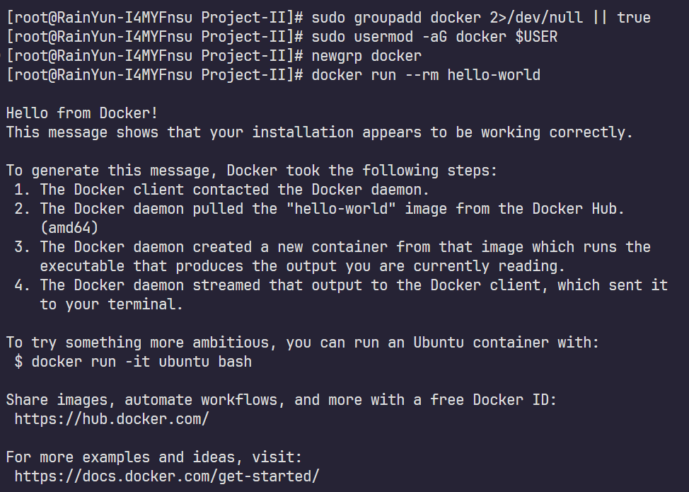
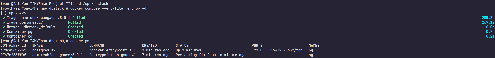

# Tutorial for Database Setup

## 0) Environment

### CentOS Stream 9

### PostgreSQL 17.7 + openGauss 5.0.1

### Docker

## 1) Install Docker Engine (CentOS Stream 9)

```bash
# Remove old packages
sudo dnf remove -y docker docker-client docker-client-latest docker-common docker-latest docker-latest-logrotate docker-logrotate docker-engine || true

# Install repo tools
sudo dnf -y install dnf-plugins-core

# Add Docker repo
sudo dnf config-manager --add-repo https://download.docker.com/linux/centos/docker-ce.repo

# Install Docker + Compose
sudo dnf -y install docker-ce docker-ce-cli containerd.io docker-buildx-plugin docker-compose-plugin

# Enable and start
sudo systemctl enable --now docker

# Smoke test
sudo docker run --rm hello-world
```

### Allow running Docker without sudo (optional, recommended)

```bash
# Create group if missing
sudo groupadd docker 2>/dev/null || true

# Add user to group
sudo usermod -aG docker $USER

# Refresh group in shell
newgrp docker

# Verify without sudo
docker run --rm hello-world
```



---

## 2) Start PostgreSQL + openGauss with Docker Compose

### 2.1 Create directories and config files

```bash
# Create dirs
sudo mkdir -p /opt/dbstack
sudo mkdir -p /srv/db/postgres /srv/db/opengauss

# Set ownership
sudo chown -R $USER:$USER /opt/dbstack /srv/db
```

Create `/opt/dbstack/.env` (password is `DBPwd_temp000`):

```bash
cat > /opt/dbstack/.env <<'EOF'
# PostgreSQL
PG_USER=postgres
PG_PASSWORD=DBPwd@temp000
PG_DB=postgres
PG_PORT=5432

# openGauss
OG_USER=gaussdb
OG_PASSWORD=DBPwd@temp000
OG_DB=postgres
OG_PORT=15432
EOF
```

Create `/opt/dbstack/docker-compose.yml` (structure unchanged):

```bash
cat > /opt/dbstack/docker-compose.yml <<'EOF'
services:
  postgres:
    image: postgres:17
    container_name: pg
    environment:
      POSTGRES_USER: ${PG_USER}
      POSTGRES_PASSWORD: ${PG_PASSWORD}
      POSTGRES_DB: ${PG_DB}
    ports:
      - "127.0.0.1:${PG_PORT}:5432"
    volumes:
      - /srv/db/postgres:/var/lib/postgresql/data:Z
    restart: unless-stopped

  opengauss:
    image: enmotech/opengauss:5.0.1
    container_name: og
    privileged: true
    environment:
      GS_PASSWORD: ${OG_PASSWORD}
      GS_NODENAME: gaussdb
      GS_USERNAME: ${OG_USER}
    ports:
      - "127.0.0.1:${OG_PORT}:5432"
    volumes:
      - /srv/db/opengauss:/var/lib/opengauss/data:Z
    restart: unless-stopped
EOF
```

Notes:

- PostgreSQL applies `POSTGRES_PASSWORD` only on first init of an empty data dir
- openGauss uses `GS_PASSWORD`
- `:Z` is for SELinux volume labeling

### 2.2 Start services

```bash
# Start stack
cd /opt/dbstack
docker compose --env-file .env up -d

# Show containers
docker ps
```



---

## 3) One-liners: Login and run any local `.sql`

### 3.1 PostgreSQL: one-line login (`psql`)

```bash
docker exec -it pg psql -U postgres -d postgres
```

### 3.2 PostgreSQL: one-line run a local `.sql`

```bash
docker exec -i pg psql -U postgres -d postgres -v ON_ERROR_STOP=1 -1 < /any/path/your.sql
```

### 3.3 openGauss: one-line login (`gsql`)

```bash
docker exec -it og bash -lc "su - omm -c 'gsql -d postgres -p 5432'"
```

### 3.4 openGauss: one-line run a local `.sql`

```bash
docker exec -i og bash -lc "su - omm -c 'gsql -d postgres -p 5432 -v ON_ERROR_STOP=on -1 -f -'" < /any/path/your.sql
```

---

## 4) Host shortcuts: `pglogin` / `pgsql` / `oglogin` / `ogsql`

### 4.1 Install scripts into `/usr/local/bin`

```bash
sudo tee /usr/local/bin/pglogin >/dev/null <<'EOF'
#!/usr/bin/env bash
set -euo pipefail
DB="${1:-postgres}"
USER="${PGUSER:-postgres}"
docker exec -it pg psql -U "$USER" -d "$DB"
EOF
sudo chmod +x /usr/local/bin/pglogin
```

```bash
sudo tee /usr/local/bin/pgsql >/dev/null <<'EOF'
#!/usr/bin/env bash
set -euo pipefail
FILE="${1:?Usage: pgsql /path/to/file.sql [dbname]}"
DB="${2:-postgres}"
USER="${PGUSER:-postgres}"
docker exec -i pg psql -U "$USER" -d "$DB" -v ON_ERROR_STOP=1 -1 < "$FILE"
EOF
sudo chmod +x /usr/local/bin/pgsql
```

```bash
sudo tee /usr/local/bin/oglogin >/dev/null <<'EOF'
#!/usr/bin/env bash
set -euo pipefail
DB="${1:-postgres}"
docker exec -it og bash -lc "su - omm -c 'gsql -d $DB -p 5432'"
EOF
sudo chmod +x /usr/local/bin/oglogin
```

```bash
sudo tee /usr/local/bin/ogsql >/dev/null <<'EOF'
#!/usr/bin/env bash
set -euo pipefail
FILE="${1:?Usage: ogsql /path/to/file.sql [dbname]}"
DB="${2:-postgres}"
docker exec -i og bash -lc "su - omm -c 'gsql -d $DB -p 5432 -v ON_ERROR_STOP=on -1 -f -'" < "$FILE"
EOF
sudo chmod +x /usr/local/bin/ogsql
```

### 4.2 Usage examples (from any directory)

```bash
pglogin
pgsql ./migrate.sql mydb

oglogin
ogsql /home/me/sql/init.sql postgres
```

---

## 5) Quick self-check

```bash
# PostgreSQL version
docker exec -i pg psql -U postgres -d postgres -c "select version();"
```

```bash
# openGauss version
docker exec -i og bash -lc "su - omm -c \"gsql -d postgres -p 5432 -c 'select version();'\""
```

---

## 6) Common issues and fixes

1. `.env` changed but password did not change  
  Images usually apply env vars only on first init of an empty data dir.

  - `docker compose down`

  - remove data dir: `/srv/db/postgres` or `/srv/db/opengauss`

  - `docker compose up -d`


2. Port conflicts

   - PostgreSQL: `127.0.0.1:5432`

   - openGauss: `127.0.0.1:15432`


3) Local-only access (safer default)  
Ports are bound to `127.0.0.1`. Remove `127.0.0.1:` if you need LAN access.

